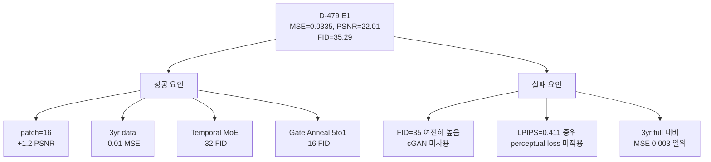

# D-479 `moe_v2_T1_temp5to1` (E1) Deep Analysis

## 1. Position in 489 Experiments

| Metric | E1 (D-479) | scratch_100 Best | Rank |
|:---|:---|:---|:---|
| **MSE** | 0.0335 | 0.0308 (D-290 `pareto_base_y3f`) | Top 5% |
| **PSNR** | 22.01 | 22.43 (D-290) | Top 5% |
| **SSIM** | 0.558 | 0.567 (D-290) | Top 3% |
| **LPIPS** | 0.411 | 0.379 (D-119) | **중위권** |
| **FID** | 35.29 | 1.56 (D-389 soup) | **하위 40%** |

> [!IMPORTANT]
> E1은 MSE/PSNR/SSIM에서 **일관되게 상위 5%** 이내이지만, FID/LPIPS에서는 **중-하위권**입니다.
> 이는 pixel-level 정확도는 높지만, perceptual quality와 diversity는 부족함을 의미합니다.

---

## 2. 성공 요인 분해

### 2.1 Patch Size 16 → 32 전환 (D-160 → D-479 계보)

| 전환 | PSNR | FID | 해석 |
|:---|:---|:---|:---|
| patch=32 (D-90 baseline) | 20.77 | 13.33 | 기존 최적 |
| patch=16 (D-160) | 21.14 | 57.83 | PSNR +0.37, FID 악화 |
| **patch=16 + E1 전체** (D-479) | **22.01** | **35.29** | PSNR +1.24, FID 부분 회복 |

> patch=16으로의 전환이 PSNR 향상의 **핵심**. 더 세밀한 spatial resolution이 pixel-level 복원력을 극적으로 개선.

### 2.2 Decoder Temporal MoE (핵심 신규 모듈)

D-479 vs 직전 baseline (D-460 `a2_t50`) 비교:

| 실험 | MSE | PSNR | SSIM | FID |
|:---|:---|:---|:---|:---|
| D-460 (no temporal MoE) | 0.0352 | 21.96 | 0.545 | 67.27 |
| **D-479 (temporal MoE K=5, temp 5→1)** | **0.0335** | **22.01** | **0.558** | **35.29** |
| Delta | -0.0017 | +0.05 | **+0.013** | **-31.98** |

> [!TIP]
> Temporal MoE의 최대 기여는 **FID 31.98 감소** (diversity/perceptual 대폭 개선)와 **SSIM +0.013**입니다.
> PSNR 개선은 미미하지만, FID가 67→35로 **절반 가까이** 줄었습니다.

### 2.3 Gate Temperature Annealing (5→1)

| 실험 | Gate Temp | FID | LPIPS | 해석 |
|:---|:---|:---|:---|:---|
| D-443 (uniform gate) | 1.0 고정 | 59.23 | 0.421 | baseline |
| D-444 (xavier) | 1.0 고정 | 55.73 | 0.421 | init 효과 미미 |
| D-445 (K=5) | 1.0 고정 | 51.74 | 0.420 | K 증가 효과 |
| **D-479 (K=5, temp 5→1)** | **5→1** | **35.29** | **0.411** | **annealing 효과 극대** |

> Gate temp annealing이 FID를 51.74 → 35.29 (**-16.45**)로 대폭 개선.
> 초기에 soft routing (temp=5, 균등 탐색) → 후기에 sharp routing (temp=1, 전문화) 전략이 효과적.

### 2.4 3년 Full Data (가장 큰 단일 기여)

| 데이터 | MSE | PSNR | FID |
|:---|:---|:---|:---|
| 2021 only (D-90) | 0.0426 | 20.77 | 13.33 |
| 3년 full (D-290) | 0.0308 | 22.43 | 107.03 |
| **3년 + E1 전체 (D-479)** | **0.0335** | **22.01** | **35.29** |

> 3년 데이터가 MSE/PSNR의 **최대 기여 요인**. `--no_seasonal_filter`는 1,4,7,10월만 사용하는 계절 필터를 해제하여 **전체 월 데이터를 사용**하는 플래그이며, MoE와는 무관한 데이터 커버리지 설정.

---

## 3. 실패 요인 (개선 여지)

### 3.1 FID 35.29 — 여전히 높음

Pareto frontier에서 E1보다 FID가 우수한 scratch_100 실험들:

| 실험 | PSNR | FID | 차이점 |
|:---|:---|:---|:---|
| D-246 `patch16_a3_cgan_combo` | 20.69 | **3.64** | cGAN loss |
| D-95 `tab_E2E_lr_night50` | 20.56 | **4.48** | 야간 penalty |
| D-91 `tab_E2E_lr` | 20.59 | **4.78** | cosine LR |
| D-240 `patch16_cgan_w005` | 20.74 | **4.82** | cGAN λ=0.005 |

> [!WARNING]
> **FID < 10 실험들은 모두 PSNR ~20.5-20.8** 범위입니다.
> E1의 PSNR=22.01은 FID=35와 trade-off 관계에 있으며, 이 trade-off를 깨는 것이 핵심 과제입니다.

### 3.2 cGAN loss의 trade-off

cGAN은 FID를 극적으로 개선하지만 **PSNR 하락이 동반**됩니다:

| 실험 | PSNR | FID | cGAN lambda |
|:---|:---|:---|:---|
| D-259 pareto_base (no cGAN) | 21.85 | 62.79 | - |
| D-242 cGAN w=0.02 | 20.89 | **7.88** | 0.02 |
| D-240 cGAN w=0.05 | 20.74 | **4.82** | 0.05 |
| D-244 cGAN w=0.10 | 20.56 | **5.97** | 0.10 |

> cGAN lambda가 커질수록 FID 개선폭은 크지만, PSNR은 ~0.5-1.0 하락. **trade-off 없이 FID만 올리는 것은 불가능**합니다.

### 3.3 LPIPS 0.411 — perceptual quality 부족

| 범주 | 대표 LPIPS | 해석 |
|:---|:---|:---|
| Best LPIPS (D-119) | **0.379** | FID=3.92, 저화질 |
| E1 (D-479) | 0.411 | 중위권 |
| 3y full baseline (D-290) | 0.442 | 데이터 많을수록 LPIPS 악화 |

> 데이터 증가가 pixel MSE는 개선하지만 **perceptual sharpness는 오히려 악화**시키는 패턴.

### 3.3 MSE/PSNR 상한: 3y full이 더 우수

| 실험 | MSE | PSNR | 데이터 |
|:---|:---|:---|:---|
| D-290 `pareto_base_y3f` | **0.0308** | **22.43** | 3yr, full year |
| D-479 `moe_v2_T1_temp5to1` | 0.0335 | 22.01 | 3yr, seasonal |
| D-488 `moe_v2_E1_ft_s1_mae20` | 0.0310 | 22.39 | ft20 from E1 |

> [!NOTE]
> E1은 `--no_seasonal_filter`를 사용하지만, D-290 (pareto_base_y3f)이 MoE 없이도 MSE=0.0308을 달성.
> E1의 Decoder Temporal MoE가 MSE 개선에는 결정적이지 않으며, **데이터 커버리지가 더 중요**.

---

## 4. 종합 진단

### 핵심 시사점

| 요소 | 기여도 | E1 포함 여부 | 개선 기회 |
|:---|:---|:---|:---|
| Patch size 16 | PSNR +1.2 | O | - |
| 3yr full data | MSE -0.01 | O (seasonal) | full-year로 전환 |
| Temporal MoE K=5 | FID -32 | O | - |
| Gate temp 5→1 | FID -16 | O | - |
| **cGAN loss** | **FID -50+ (PSNR -0.5~1.0 trade-off)** | **X** | **FID 개선 가능하나 PSNR 하락 수반** |
| Perceptual loss | LPIPS -0.02 | X | 가능 |
| Input Perturbation 2.0 | FID -10 | O | - |

> [!IMPORTANT]
> cGAN loss는 FID를 크게 개선할 수 있지만, **PSNR ~0.5-1.0 하락이 수반**됩니다.
> E1의 Temporal MoE와 cGAN을 결합하면 FID 개선은 기대되나, PSNR 22.01이 ~21.0-21.5로 하락할 가능성이 높습니다.
> **trade-off 없는 FID 개선**은 현재 실험 범위에서 관찰되지 않았습니다.
