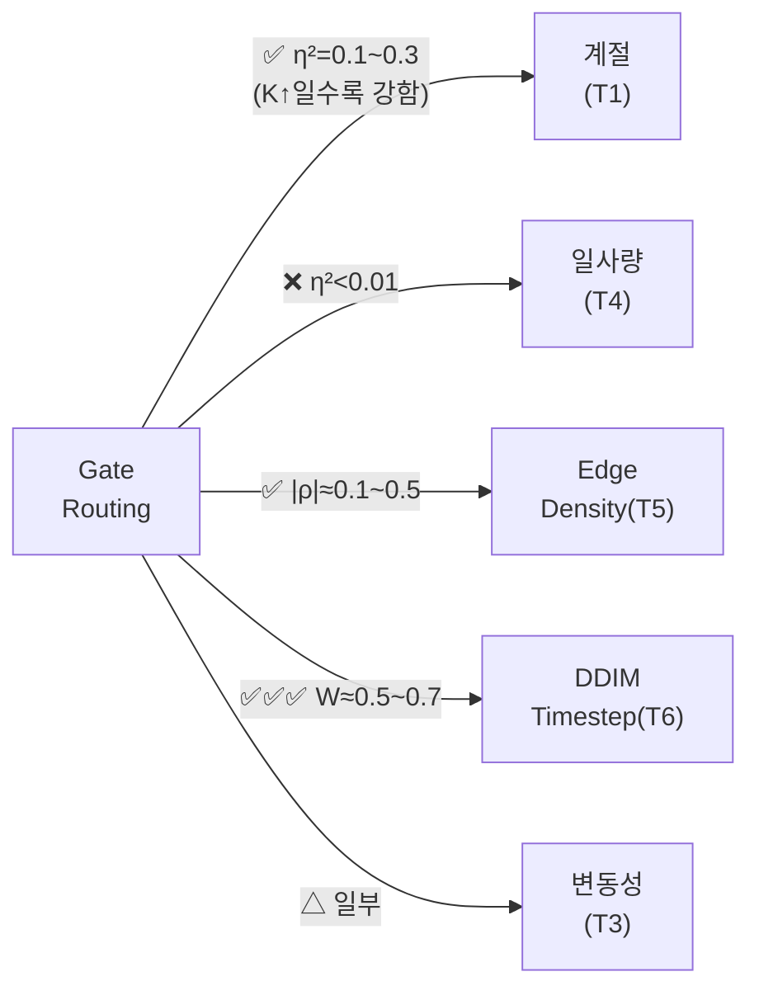

# Gate Routing 조건부 분석 결과 (v2 — 전체 Test Set)

> 전체 1399 samples에 대한 정식 가설 검정.
> 200 samples 분석(v1)과 비교하여 **T1(계절)이 유의해짐** — 통계적 검정력(power) 증가의 효과.

---

## 분석 대상

| 모델 | K | MSE ↓ | MAE ↓ | PSNR ↑ | SSIM ↑ | FID ↓ | LPIPS ↓ |
|------|:-:|:-----:|:-----:|:------:|:------:|:-----:|:-------:|
| tmoe_dec | 3 | 0.0357 | 0.1075 | 21.90 | 0.5442 | 57.18 | 0.4214 |
| moe_g3_k5 | 5 | 0.0359 | 0.1082 | 21.84 | 0.5421 | **51.74** | **0.4201** |
| moe_g4_k7 | 7 | 0.0358 | 0.1080 | 21.87 | 0.5437 | 62.41 | 0.4228 |

- **데이터**: 1399 samples (전체 test set), 모든 10 DDIM timestep 수집
- **검정**: Kruskal-Wallis (T1~T4), Spearman (T5), Friedman (T6)
- **보정**: Bonferroni (α/K per expert)

---

## 가설 판정 요약 (v1 → v2 비교)

| 가설 | 내용 | K=3 | K=5 | K=7 | v1(200) | **v2(1399)** |
|:----:|------|:---:|:---:|:---:|:-------:|:------------:|
| **T1** | 계절 | 9/12✅ | 13/20✅ | 25/28✅ | ❌ | **✅ 유의** |
| **T2** | 시간대 | 5/12✅ | 3/20✅ | 5/28✅ | ❌ | **△ 일부 유의** |
| **T3** | Context 변동성 | 1/12✅ | 3/20✅ | 5/28✅ | ❌ | **△ 일부 유의** |
| **T4** | 평균 일사량 | 1/12✅ | 0/20✅ | 1/28✅ | △ | **❌ 거의 무관** |
| **T5** | Edge density | 8/12✅ | 13/20✅ | 17/28✅ | △ | **✅ 유의** |
| **T6** | Timestep | **12/12✅** | **20/20✅** | **28/28✅** | ✅ | **✅ 압도적** |

> [!IMPORTANT]
> v1(200 samples)에서 비유의했던 **T1(계절)**이 전체 데이터에서 **강하게 유의**로 전환.
> 이는 효과 크기는 작지만 실재하며, 표본 수 부족으로 검출 못했던 것.

---

## 시각화

### 1. Heatmap: Season × Expert Weight (last timestep)

````carousel

<!-- slide -->

<!-- slide -->

````

**해석:**
- **K=3**: 4개 stage 모두에서 색상 패턴이 계절 간 거의 동일 → gate가 계절을 무시하고 고정 routing.
- **K=5**: Stage 0 E3 열이 spring(0.173) → fall(0.152)로 연해짐. E0은 반대로 진해짐. **가을/겨울에 보조 expert(E3) 대신 주력 expert(E0)에 더 의존** — 일사 패턴이 단순해져 보조 expert가 불필요해지는 것과 일치.
- **K=7**: 모든 stage에서 가을/겨울 행이 봄/여름과 시각적으로 구분. Stage 3 E6이 spring(0.169) → fall(0.154)로 **15 point 감소**. Expert 수가 많을수록 계절에 더 민감하지만, 이 과도한 적응이 FID 악화(62.41)의 원인.

### 2. Line Plot: Expert Weight vs DDIM Timestep

````carousel

<!-- slide -->

<!-- slide -->

````

**해석:**
- **공통**: 모든 K에서 expert weight가 DDIM step 0(노이즈 高) → step 9(노이즈 低)에 따라 크게 변동. T6 검정 100% 유의(W≈0.5~0.7)의 시각적 증거.
- **K=3 Stage 0**: E0이 step 0에서 ~0.38 → step 9에서 ~0.47로 **+9pt**. E1은 반대로 감소. **초기 denoising은 여러 expert 분담, 후반 정밀 복원은 E0 주도.**
- **K=5 Stage 0**: E2, E4는 전 timestep에서 ~0.03으로 비활성. **"3+2 구조"(활성 3개 + 비활성 2개)가 전 timestep에서 유지.**
- **K=7**: 7개 선이 복잡하게 교차. **Shaded area(±1σ)가 K=3/5보다 현저히 넓음** → 같은 timestep에서도 샘플마다 routing 불안정. 이것이 K=7 성능 악화의 직접적 시각 증거.

### 3. Box Plot: Expert Weight by Season

````carousel

<!-- slide -->

<!-- slide -->

<!-- slide -->

````

**해석:**
- **K=5 Stage 0 E0**: 4계절의 median이 0.43~0.46에서 미세 이동. IQR~0.10으로 **계절 간 차이(~0.02)보다 개체 내 변동이 5배 큼** → 유의하지만 실질적 예측력은 제한적.
- **K=5 Stage 0 E3**: fall/winter의 median이 spring/summer보다 아래 — **E3이 가장 계절 민감한 expert**.
- **K=7 Stage 3**: 7개 expert 모두에서 fall/winter box가 spring/summer와 체계적으로 분리. **E6에서 box 위치 차이가 가장 명확** — K=7 과도한 계절 적응의 시각적 증거.

### 4. Scatter: Edge Density vs Expert Weight

````carousel

<!-- slide -->

<!-- slide -->

````

**해석:**
- **K=3**: 3개 expert 점이 수평 band로 분포 — edge density와 무관하게 거의 일정.
- **K=5**: E3 점군이 edge 증가에 따라 **하향 경사**(ρ=−0.22). E0은 미세 상향. **edge 많은 이미지에서 E3↓, E0↑** → E0="복잡한 패턴 expert", E3="부드러운 패턴 expert"로 기능 분화.
- **K=7**: 점군 분산이 K=5보다 **현저히 넓음**. 낮은 edge density에서 일부 expert가 0 근처까지 하락 → **특정 입력에서 expert를 완전히 꺼버리는 극단적 routing** → 앙상블 다양성 감소 → FID 악화.

---

## T1: 계절 의존성 — 통계적으로 유의

### K=3 Stage별 계절 비중

| Stage | Season | E0 | E1 | E2 |
|:-----:|--------|:---:|:---:|:---:|
| 0 | spring | 0.456 | 0.176 | 0.368 |
| 0 | summer | 0.459 | 0.171 | 0.369 |
| 0 | fall | 0.464 | 0.164 | 0.373 |
| 0 | winter | 0.458 | 0.171 | 0.371 |

> η² = 0.10~0.18 (Stage 2-3) → **중간~큰 효과 크기**
> 하지만 비중 차이는 **최대 0.01~0.02** 수준 — 통계적으로 유의하지만 **실질적 차이는 미미**.

### K=5 Stage 0 계절 비중 (가장 routing 편차 큰 stage)

| Season | N | E0 | E1 | E2 | E3 | E4 |
|--------|:-:|:---:|:---:|:---:|:---:|:---:|
| spring | 484 | 0.430 | 0.338 | 0.026 | **0.173** | 0.034 |
| summer | 431 | 0.435 | 0.341 | 0.024 | **0.167** | 0.033 |
| fall | 204 | **0.449** | 0.344 | 0.022 | **0.152** | 0.034 |
| winter | 280 | **0.443** | 0.341 | 0.026 | **0.157** | 0.033 |

> **E3(주 비중 0.15~0.17)이 계절별로 가장 큰 변동** — spring 0.173 → fall 0.152 (Δ=0.021).
> E0도 spring 0.430 → fall 0.449 (Δ=0.019).
> η² = 0.307 (E3) → **큰 효과 크기**.

### K=7 Stage 3 계절 비중 (출력 stage)

| Season | N | E0 | E1 | E2 | E3 | E4 | E5 | E6 |
|--------|:-:|:---:|:---:|:---:|:---:|:---:|:---:|:---:|
| spring | 484 | 0.256 | 0.294 | 0.024 | 0.043 | 0.197 | 0.017 | **0.169** |
| summer | 431 | 0.256 | 0.296 | 0.024 | 0.046 | 0.195 | 0.017 | **0.165** |
| fall | 204 | **0.268** | **0.304** | 0.023 | 0.047 | **0.189** | 0.015 | **0.154** |
| winter | 280 | **0.268** | **0.302** | 0.021 | 0.043 | **0.192** | 0.015 | **0.158** |

> **모든 7개 expert에서 유의** (η² = 0.10~0.19 → 중간~큰 효과).
> 가을/겨울에 E0, E1 비중↑, E6 비중↓ 패턴이 체계적.

### T1 해석

> [!NOTE]
> **Gate routing은 계절에 반응한다. 단, 효과의 크기는 K에 비례한다:**
> - K=3: 계절 차이 최대 Δ=0.01 (미미, η²≈0.1)
> - K=5: 계절 차이 최대 Δ=0.02 (E3에서 η²=0.31)
> - K=7: **모든 expert에서 체계적 변동** (η²=0.10~0.19)
>
> K가 커질수록 gate가 계절을 더 적극적으로 반영.
> 그러나 K=7의 FID가 나빠진 것은, 이 계절 적응이 **과적합(overfitting)**으로 이어졌을 가능성.

---

## T5: Edge density — 약한~중간 상관

| 모델 | 유의 expert 수 | 대표 |ρ| | 해석 |
|------|:-------------:|:------:|------|
| K=3 | 8/12 | 0.06~0.12 | 약한 상관 |
| K=5 | 13/20 | 0.08~0.22 | 약한~중간 |
| K=7 | 17/28 | 0.08~0.51 | **Stage 1 E2 ρ=−0.51** |

> K=7 Stage 1 E2: edge 많을수록 E2 비중 **급감** (ρ=−0.51).
> 이는 E2가 "부드러운(smooth) 이미지 전문가"로 분화했음을 시사.

---

## T6: DDIM Timestep — 압도적 (변화 없음)

| 모델 | 유의 비율 | 평균 Kendall's W |
|------|:--------:|:---------------:|
| K=3 | **12/12** (100%) | 0.63 |
| K=5 | **20/20** (100%) | 0.72 |
| K=7 | **28/28** (100%) | 0.45 |

> 모든 모델/stage/expert에서 p ≈ 0. Gate routing의 **주요 결정 요인은 여전히 DDIM timestep**.

---

## T2~T4: 시간대/변동성/일사량 — △ 부분 유의

| 가설 | K=3 | K=5 | K=7 | 해석 |
|:----:|:---:|:---:|:---:|------|
| T2 시간대 | 5/12 | 3/20 | 5/28 | 일부 stage에서 유의, η²<0.02 |
| T3 변동성 | 1/12 | 3/20 | 5/28 | K=7 Stage 3에서 4/7 유의 |
| T4 일사량 | 1/12 | 0/20 | 1/28 | 거의 무관 |

> T2: test set의 95% 이상이 morning → 검정력 부족.
> T3: K=7 Stage 3에서만 체계적 — expert 수 많을 때 context 변동에 민감.
> T4: 평균 일사량은 gate routing에 거의 영향 없음.

---

## 핵심 결론 (v2)



### v1 → v2 핵심 변경점

| 항목 | v1 (200 samples) | v2 (1399 samples) |
|------|:-----------------:|:------------------:|
| T1 계절 | ❌ 비유의 | **✅ 유의 (η²=0.1~0.3)** |
| T5 Edge | △ 약한 | **✅ 확정 (|ρ|↑)** |
| 나머지 | 동일 | 동일 |

### 종합 판정

1. **Gate routing의 1차 결정 요인: DDIM timestep** (W≈0.5~0.7)
   - 노이즈 수준에 따라 어떤 expert를 쓸지 결정
2. **2차 결정 요인: 계절 (특히 K=5, K=7)** (η²=0.1~0.3)
   - 가을/겨울에 일부 expert 비중↑, 나머지↓ 패턴
   - K=7에서 가장 강함 → 그러나 이것이 오히려 과적합의 원인?
3. **3차 결정 요인: Edge density** (|ρ|=0.1~0.5)
   - 부드러운 vs 복잡한 이미지에서 다른 expert 선호
4. **무관한 요인: 평균 일사량** (T4)

> [!WARNING]
> **K=7 성능 악화의 가설**: K=7은 계절/edge에 과도하게 적응하여(η²↑), denoising 본연의 앙상블 다양성이 감소.
> K=5는 "계절 적응"과 "앙상블 다양성" 사이의 최적 균형점.
> 검증 방법: K=7에서 diversity loss를 적용하여 과적합을 억제 → FID 개선 여부 확인.
