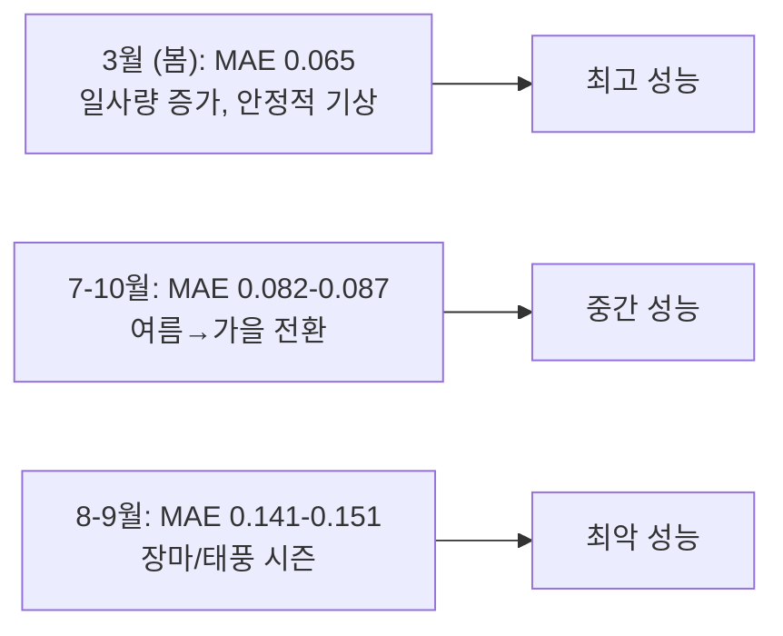

# 계절별 성능 편차 분석 — ctx_S_L_D + t-Gate 실험

## 1. Overall 요약

| Experiment | MAE | PSNR | SSIM | LPIPS | FID |
|---|---|---|---|---|---|
| **ctx_S_L_D** | **0.1062** | **21.96** | **0.5446** | **0.4238** | **64.29** |
| E0 tgate_baseline | 0.1073 | 21.89 | 0.5428 | 0.4250 | 66.92 |
| E1 stem t-gate | 0.1068 | 21.93 | 0.5433 | 0.4255 | 83.37 |
| **E2 dec t-gate** | 0.1074 | 21.88 | 0.5428 | **0.4225** | **61.63** |
| E3 both t-gate | 0.1080 | 21.87 | 0.5418 | 0.4203 | 68.09 |

> [!NOTE]
> - **E2 (decoder t-gate)**: FID 61.63 — ctx_S_L_D(64.29) 대비 **4.1% 개선**, LPIPS도 최저
> - E1 (stem t-gate): FID 83.37로 크게 악화 — stem에 t-modulation이 유해
> - MAE는 모든 variant에서 ctx_S_L_D를 이기지 못함

---

## 2. 계절별 (Season) 분석

### MAE by Season

| Season | ctx_S_L_D | E0 base | E1 stem | E2 dec | E3 both | N |
|---|---|---|---|---|---|---|
| **Spring** | **0.0915** | 0.0925 | 0.0921 | 0.0928 | 0.0932 | 484 |
| **Summer** | 0.1092 | 0.1107 | 0.1099 | 0.1107 | 0.1111 | 424 |
| **Autumn** | 0.1205 | 0.1212 | 0.1212 | 0.1212 | 0.1222 | 211 |
| **Winter** | 0.1165 | 0.1171 | 0.1168 | 0.1175 | 0.1179 | 280 |

> [!IMPORTANT]
> **Spring이 MAE 0.09로 가장 좋고, Autumn이 0.12로 가장 나쁨 — 약 33% 차이!**

### PSNR by Season

| Season | ctx_S_L_D | E0 base | E1 stem | E2 dec | E3 both |
|---|---|---|---|---|---|
| Spring | **23.42** | 23.34 | 23.39 | 23.32 | 23.31 |
| Summer | 21.61 | 21.52 | 21.57 | 21.53 | 21.51 |
| Autumn | 20.26 | 20.21 | 20.23 | 20.21 | 20.19 |
| Winter | 21.27 | 21.23 | 21.26 | 21.20 | 21.19 |

### SSIM by Season

| Season | ctx_S_L_D | E0 base | E1 stem | E2 dec | E3 both |
|---|---|---|---|---|---|
| Spring | **0.600** | 0.598 | 0.599 | 0.598 | 0.597 |
| Summer | 0.508 | 0.505 | 0.506 | 0.505 | 0.504 |
| Autumn | 0.543 | 0.542 | 0.542 | 0.542 | 0.541 |
| Winter | 0.507 | 0.505 | 0.506 | 0.505 | 0.504 |

### LPIPS by Season (↓ is better)

| Season | ctx_S_L_D | E0 base | E1 stem | E2 dec | E3 both |
|---|---|---|---|---|---|
| Spring | 0.417 | 0.418 | 0.418 | **0.416** | **0.414** |
| Summer | 0.453 | 0.455 | 0.455 | **0.449** | **0.449** |
| Autumn | 0.410 | 0.413 | 0.414 | **0.413** | **0.406** |
| Winter | 0.401 | 0.401 | 0.402 | 0.400 | **0.399** |

> [!TIP]
> **LPIPS에서는 E3 (both t-gate)가 전 계절 최저** — perceptual quality는 t-gate가 개선

---

## 3. 월별 (Month) 분석 — ctx_S_L_D 기준

### MAE by Month (ctx_S_L_D)

```
Mar ████████████░░░░░░░░░░░░░░  0.0654  (최고)
Jul █████████████████░░░░░░░░░  0.0822
Oct █████████████████░░░░░░░░░  0.0866
May ███████████████████░░░░░░░  0.0930
Feb ███████████████████░░░░░░░  0.0949
Apr ██████████████████████░░░░  0.1120
Jun ████████████████████████░░  0.1204
Dec █████████████████████████░  0.1245
Nov █████████████████████████░  0.1260
Jan ██████████████████████████  0.1287
Aug ████████████████████████████ 0.1409
Sep █████████████████████████████ 0.1508  (최악)
```

### 핵심: 최악 vs 최고 월 비교

| 항목 | 최고 (3월) | 최악 (9월) | 비율 |
|---|---|---|---|
| MAE | 0.0654 | 0.1508 | **2.3x 차이** |
| MSE | 0.0160 | 0.0600 | **3.7x 차이** |
| PSNR | 25.64 | 18.48 | -7.16 dB |
| SSIM | 0.706 | 0.415 | -0.291 |
| LPIPS | 0.348 | 0.483 | +0.135 |
| N (샘플) | 136 | 77 | |

> [!WARNING]
> **9월(태풍 시즌)과 8월(장마)이 압도적으로 나쁨**  
> 이 두 달이 overall MAE를 0.106까지 끌어올리는 주범

---

## 4. t-Gate의 계절별 효과

### 월별 MAE 변화율 (vs ctx_S_L_D)

| Month | E2 dec Δ% | E1 stem Δ% | E3 both Δ% |
|---|---|---|---|
| Jan | +0.8% | +0.1% | +1.2% |
| Feb | +0.6% | +1.0% | +2.3% |
| Mar | +1.6% | +1.1% | +2.7% |
| Apr | +1.4% | +0.5% | +1.5% |
| May | +1.6% | +0.8% | +2.0% |
| Jun | +1.4% | +0.6% | +1.5% |
| Jul | +1.6% | +0.6% | +2.7% |
| Aug | +0.9% | +0.5% | +1.0% |
| **Sep** | **+0.8%** | **+0.9%** | **+1.3%** |
| Oct | +0.1% | +0.7% | +1.6% |
| Nov | +0.6% | -0.0% | +1.5% |
| Dec | +0.4% | -0.1% | +0.4% |

> t-gate는 어떤 계절에서도 MAE를 개선하지 못함 — **일관되게 +0.1~2.7% 악화**

---

## 5. 구조적 인사이트

### 계절 성능 패턴



### 왜 8-9월이 나쁜가?

1. **태양광 변동성 극대**: 구름 이동이 빠르고 불규칙
2. **극단적 기상 이벤트**: 태풍, 장마 → 분포 외 패턴
3. **샘플 수 부족**: 77-82개 (전체의 5.5-5.9%)
4. **Persistence baseline도 나쁠 것**: 급변 날씨에서 "어제와 같다"가 더 틀림

### 논문 시사점

- **월별/계절별 성능 분석 필수**: 연간 평균만으로는 모델 성능을 과장
- **8-9월 개선이 overall MAE 개선의 키**: 이 두 달만 10% 개선해도 overall MAE ~0.003 감소
- **계절별 adaptive 모델**: seasonal context token이 이를 위해 설계됨

---

## 6. E2 (Decoder t-gate) 심층 분석

FID가 유일하게 개선 (64.29 → 61.63):

| 계절 | ctx_S_L_D LPIPS | E2 LPIPS | Δ |
|---|---|---|---|
| Spring | 0.417 | **0.416** | -0.001 |
| Summer | 0.453 | **0.449** | **-0.004** |
| Autumn | 0.410 | 0.413 | +0.003 |
| Winter | 0.401 | 0.400 | -0.001 |

> **Summer에서 LPIPS 개선이 가장 큼** → 변동이 큰 시기에 decoder t-gate가 perceptual quality를 개선  
> 그러나 MAE는 전 계절 악화 → **MAE-FID 트레이드오프 확인**
