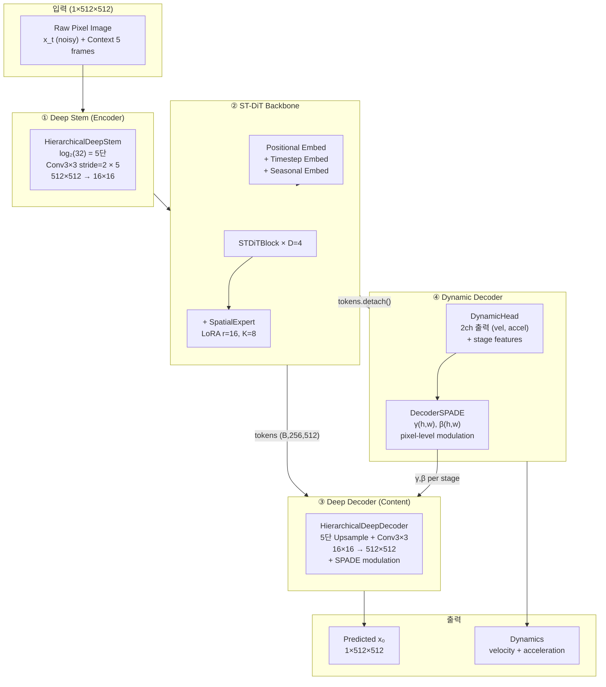

# Track B (Deep Series Raw Pixel) — 아키텍처 4관점 분석 보고서

> 작성: 2026-05-20  
> 대상: ST-DiT2/ST-DiT — Raw Pixel Pipeline (D=4, P=32, H=512, x0 prediction)  
> 분석 소스: [st_dit.py](file:///data/student1/docker_Solar/ST-DiT2/ST-DiT/stdit/models/st_dit.py), [stem.py](file:///data/student1/docker_Solar/ST-DiT2/ST-DiT/stdit/models/stem.py), [decoder.py](file:///data/student1/docker_Solar/ST-DiT2/ST-DiT/stdit/models/decoder.py), [blocks.py](file:///data/student1/docker_Solar/ST-DiT2/ST-DiT/stdit/models/blocks.py), [spatial_expert.py](file:///data/student1/docker_Solar/ST-DiT2/ST-DiT/stdit/models/spatial_expert.py)  
> 챔피언 config: `tab_E2E_lr_night50` (FID 4.48, LPIPS 0.389, SSIM 0.537)

---

## 0. 전체 아키텍처 흐름도



### 핵심 수치 (D=4, P=32, H=512)

| 구성요소 | 토큰 수 | 파라미터 | 입출력 해상도 |
|---|:---:|:---:|:---:|
| Deep Stem | — | ~1.3M | 512² → 16² |
| ST-DiT Backbone (4블록) | 256 | ~34M | 16² tokens |
| Spatial Expert (8E×4블록) | — | ~2.1M | token-level |
| Deep Decoder | — | ~1.3M | 16² → 512² |
| DynamicHead | — | ~0.5M | 16² → 512² |
| DecoderSPADE (5 layers) | — | ~0.3M | pixel-level |
| **총계** | | **~39.5M** | |

---

## 1. ① Deep Stem (HierarchicalDeepStem) — 인코더

### 1.1 설계 의도

[stem.py L102-236](file:///data/student1/docker_Solar/ST-DiT2/ST-DiT/stdit/models/stem.py#L102-L236)

```
Input (1, 512, 512)
  ↓ Conv3×3 stride=2, GELU   → (16, 256, 256)    # Stage 0
  ↓ Conv3×3 stride=2, GELU   → (32, 128, 128)    # Stage 1
  ↓ Conv3×3 stride=2, GELU   → (64, 64, 64)      # Stage 2
  ↓ Conv3×3 stride=2, GELU   → (128, 32, 32)     # Stage 3
  ↓ Conv3×3 stride=2, GELU   → (512, 16, 16)     # Stage 4
  ↓ flatten + transpose → (B, 256, 512) tokens
```

- **ConvNeXt/Swin V2 패턴**: log₂(P)=5단 점진 다운샘플로 intra-patch reasoning 깊이 확보
- **채널 스케줄**: `start_ch = max(H // 2^(depth-1), 16)` = 16 → 매 stage 2배 증가 → H에서 cap
- **정규화 없음**: BatchNorm/GroupNorm 제거 — diffusion noise 분포 보존 정책
- **Xavier init + zero bias**: noise-scale 보존

### 1.2 설계 분석 관점

**강점**:
- 단층 Conv(kernel=32)를 5단 Conv3×3 stride=2로 대체 → **receptive field 점진 확대**로 intra-patch 패턴 학습
- CNNStem 대비 파라미터 ~30-100× 절약 (P=32 기준 CNNStem conv2 weight: 512×hidden×32×32 = 268M vs Deep Stem ~1.3M)
- Dual-Scale Fusion 옵션: Stage(depth-2) feature를 α·fine + (1-α)·coarse로 fusion → 멀티스케일 주입

**약점**:
- **5단 stride=2에서 공간 정보 과도 압축** — 512→16 (1024배 축소). 각 토큰이 커버하는 영역이 32×32 pixel
- **GELU만 사용** — 비선형성은 있지만 skip connection 없음. 초기 stage의 fine-grained 신호가 5번 비선형 변환을 거치며 소실 가능
- **입출력 채널 비대칭**: 1ch → 512ch로 512× 팽창. 초기 16ch stage에서 표현력 부족 우려

**개선 방향**:
1. **Residual connection 추가** (stride=2에서는 strided conv로 downsample) — gradient flow 강화
2. **초기 채널 확대**: `start_ch = 32` 또는 `64`로 시작 → fine-grained 표현 보존
3. **Attention 주입**: Stage 3-4에서 lightweight self-attention (Swin-style window) 추가 → global dependency 학습

### 1.3 구현 품질 검수 관점

**강점**:
- `expose_features=True` path에서 U-Net skip을 위한 `ModuleList` 분기가 깔끔하게 구현
- `dual_scale` 옵션의 zero-init fine_proj → 학습 초기 baseline 동등 보장
- Power-of-2 검증 (`patch_size & (patch_size - 1) != 0`)

**약점**:
- **두 개의 실행 경로** (`expose_features` vs Sequential): ckpt 호환을 위한 분기지만 `state_dict` key 구조가 달라짐 (`stem.0.weight` vs `stages.0.conv.weight`) — 전환 시 수동 key 매핑 필요
- `_StemStage` helper가 `Conv + GELU` 2 ops를 감싸지만 `nn.Sequential`으로도 충분 — 모듈 과분화

**제안**:
- Sequential path를 deprecate하고 `stages` ModuleList를 표준 경로로 통일 → 유지보수 간소화

### 1.4 방법론 및 실험 검토 관점

**강점**:
- 설계 문서(`Spatial MoE for Raw Pixel Pipeline.md`)가 동기를 명시: "단층 patch_embed는 intra-patch 선형 압축에 불과"
- ConvNeXt/Swin V2 스타일의 선행 연구 인용 가능

**약점**:
- **normalization 제거의 근거 불충분** — "diffusion noise 보존"이라 했으나, DDPM 원본 U-Net은 GroupNorm 사용. 근거 정량화 필요 (norm 유무에 따른 학습 안정성 비교 ablation)
- **ablation 부재**: Deep Stem vs CNNStem vs Linear Stem의 Track B 환경 직접 비교 없음. 설계 문서는 DWT 환경 기반

**제안**:
- **Stem ablation 3-way 비교**: Linear / CNNStem / Deep Stem 각각 scratch 100ep → 3-seed → 공정 비교

### 1.5 도메인 적합성 관점

**강점**:
- 일사량 위성 영상은 **대규모 cloud structure**(~100km) + **fine cloud edge**(~1km) 공존 — 점진 압축이 두 스케일 모두 포착에 유리

**약점**:
- **야간 영역(GT≈0)에서 5단 비선형이 과잉 처리** — pixel 값이 거의 0인 영역에 5번 Conv+GELU를 적용하는 것은 computational waste
- **32×32 patch가 약 64km² 영역** — 중규모 cloud 하나가 하나의 토큰에 완전히 포함될 수 있어 sub-cloud 구조 학습 불가

**제안**:
- **patch=16 이미 검증** (direction_corr +91%). Deep Stem stage 수 자동 조정(log₂(P))이므로 P=16도 seamless

---

## 2. ② ST-DiT Backbone (STDiTBlock × D=4)

### 2.1 설계 의도

[blocks.py L34-301](file:///data/student1/docker_Solar/ST-DiT2/ST-DiT/stdit/models/blocks.py#L34-L301)

각 블록:
```
┌─────────────────────────────────────┐
│  Stage 1: Self-Attention            │
│    adaLN(x, shift1, scale1)         │
│    → MultiheadAttention (or SDPA)   │
│    → x + gate1 * attn_out          │
├─────────────────────────────────────┤
│  Stage 2: Cross-Attention           │
│    adaLN(x, shift2, scale2)         │
│    → CrossAttention(x, context)     │
│    → x + gate2 * cross_out         │
├─────────────────────────────────────┤
│  Stage 3: FFN (+ Spatial Expert)    │
│    adaLN(x, shift3, scale3)         │
│    → MLP(GELU, 512→2048→512)       │
│    → + SpatialExpert(K=8, r=16)    │
│    → x + gate3 * mlp_out           │
└─────────────────────────────────────┘
```

**Spatial Expert** ([spatial_expert.py](file:///data/student1/docker_Solar/ST-DiT2/ST-DiT/stdit/models/spatial_expert.py)):
- K=8 LoRA expert (rank=16), soft routing per-token
- `delta = Σ_k w_k · up_k · down_k · x` → MLP 출력에 잔차 추가
- zero-init up → 초기 delta=0 (baseline 동등)

**Conditioning**:
- **Timestep**: Sinusoidal → MLP
- **Seasonal/Hour**: TemporalSeasonalEmbedder
- **Lead Time**: Embedding lookup
- **adaLN**: `9 × hidden_size` projection → (shift, scale, gate) × 3 stages
- **CFG**: null_context_token으로 classifier-free guidance

### 2.2 설계 분석 관점

**강점**:
- **adaLN conditioning이 모든 stage에 침투** — timestep, season, lead time이 self-attn/cross-attn/FFN 모두에 영향. 표준 DiT 설계
- **Spatial Expert LoRA**: 가벼운 파라미터(~2.1M)로 token-level spatial 다양성 주입. soft routing이 hard MoE 대비 안정적
- **D=4 충분** — depth sweep에서 D=1~8이 noise 안에서 동등 (0093 review). inductive bias가 capacity를 대체

**약점**:
- **토큰 수 256 = 16×16**: 전체 self-attention (O(N²) = O(65536)) — 작아서 비용은 문제 아니지만, **공간 해상도가 극히 낮음**. 한 토큰이 32×32 pixel을 대표
- **Cross-attention context**: 5 context frames × 256 tokens = 1280 KV. 시간 축 mixing이 cross-attn에 전적으로 의존
- **MLP 비율 4×**: 표준이지만, Spatial Expert와 병렬 동작 시 FFN이 이미 spatial expert가 처리할 패턴까지 학습 → **역할 중복** 가능

**개선 방향**:
1. **Window attention (Swin-style)** — 이미 `SwinSTDiTBlock` 구현 있으나 Track B에서 검증 안 됨. patch=16 (N=1024)에서 유효성 높아짐
2. **Temporal attention 분리** — 현재 cross-attn이 5 frames를 단일 KV로 처리. frame별 attention → temporal attention 추가 시 motion 학습 직접 강화
3. **SwiGLU MLP 교체** — 이미 `use_swiglu=True` 구현 완료. 파라미터 동등에 표현력 우위 (SD3/FLUX 표준)

### 2.3 구현 품질 검수 관점

**강점**:
- `nn.MultiheadAttention` vs manual QKV+SDPA 분기가 `pos_embed_type`에 따라 깔끔하게 구현
- Spatial Expert의 `_compute_delta`가 `torch.compile` 호환 (explicit loop, no einsum dynamic shape)
- adaLN `9×H` projection이 단일 Linear → chunk로 처리 — 메모리 효율

**약점**:
- **`inspect.signature` 런타임 호출** (L256): MoE FFN forward 시그니처 동적 검사 → torch.compile에서 graph break 유발 가능. 정적 attribute flag로 대체해야 함
- **`spatial_expert` attachment가 외부(`st_dit.py`)에서 수행** — block 자체의 `__init__`에서 선언하지 않아 IDE 타입 추론·autocompletion 불완전
- **adaLN gate 관련 분기 복잡**: `use_expert_gate`에 따라 9-chunk vs 10-chunk, gate3_exp 분기 — 가독성 저하

**제안**:
- `inspect.signature` 제거 → `hasattr(self.mlp, 'supports_x_prev')` 같은 정적 flag
- Spatial Expert를 `__init__` 파라미터로 받아 명시적 선언

### 2.4 방법론 및 실험 검토 관점

**강점**:
- DiT (Peebles & Xie, 2023) 원 설계에 충실한 adaLN + gated residual
- Spatial Expert가 Switch Transformer/LoRA의 아이디어를 결합 — novelty claim 가능

**약점**:
- **D=4 sweet spot의 근거 약함** — D=1~8 sweep이 noise 안에서 변별력 없음 (3-seed σ 내). "D=4가 최적"이 아니라 "D에 둔감"이 정확한 결론. 파라미터 효율 claim을 위해 D=2 vs D=4 정밀 비교 필요
- **Spatial Expert K=8의 ablation 부재** — K=2/4/8/16 sweep 없음. K=8은 Track A의 Hetero MoE에서 유래한 숫자
- **cross-attn이 temporal mixing의 유일한 경로** — 이 claim을 뒷받침할 attention map 시각화 미제공

**제안**:
- attention map 시각화: cross-attn에서 각 context frame의 기여도 분석
- K sweep (2/4/8/16) + rank sweep (8/16/32) → Spatial Expert 최적 구성 탐색

### 2.5 도메인 적합성 관점

**강점**:
- Seasonal embedding이 일사량 데이터의 계절 변동 (여름 SZA ↓, 겨울 SZA ↑) 직접 반영
- Cross-attn으로 과거 5 프레임(2.5시간) 참조 → NWP 없이 cloud motion 포착 시도

**약점**:
- **30분 lead에서 persistence와의 격차 3.7%만** — cross-attn이 motion을 충분히 학습하지 못함을 시사
- **Global attention은 한반도 전역을 혼합** — 지역별 기상 차이(남해 해양성 vs 내륙 대륙성)를 무차별 mixing

**제안**:
- **Lead time을 AdaLN conditioning 외에 attention bias로도 주입** — longer lead에서 더 넓은 context 참조 유도
- **계절별 expert routing 분석** — Spatial Expert의 routing 패턴이 계절에 따라 변하는지 검증

---

## 3. ③ Deep Decoder (HierarchicalDeepDecoder) — 콘텐츠 디코더

### 3.1 설계 의도

[decoder.py L120-393](file:///data/student1/docker_Solar/ST-DiT2/ST-DiT/stdit/models/decoder.py#L120-L393)

```
tokens (B, 256, 512) → reshape (B, 512, 16, 16)
  ↓ Bilinear↑2× + Conv3×3 + GELU   → (256, 32, 32)     # Stage 0
  ↓ Bilinear↑2× + Conv3×3 + GELU   → (128, 64, 64)     # Stage 1
  ↓ Bilinear↑2× + Conv3×3 + GELU   → (64, 128, 128)    # Stage 2
  ↓ Bilinear↑2× + Conv3×3 + GELU   → (32, 256, 256)    # Stage 3
  ↓ Bilinear↑2× + Conv3×3          → (1, 512, 512)     # Stage 4 (no GELU)
Output: x₀ prediction
```

- **Stem의 정확한 mirror**: 채널 반감 + bilinear upsample
- **마지막 Conv zero-init**: 학습 초기 출력=0 → `persistence_residual` 모드에서 persistence 예측과 동등
- **SPADE modulation 삽입점**: 각 stage Conv 직후, GELU 전에 `DecoderSPADE(motion_feat)` 적용

### 3.2 설계 분석 관점

**강점**:
- **Bilinear upsample → Conv3×3** 조합이 ConvTranspose2d의 checkerboard artifact 완전 회피
- **SPADE 삽입 위치 최적**: Conv 직후 (feature 생성 직후), GELU 전 (비선형 변환 전) → motion 정보가 scale/shift에 직접 반영
- **zero-init 마지막 Conv**: 학습 초기 decoder 출력=0 → persistence baseline에서 출발

**약점**:
- **Skip connection 없음 (기본 모드)** — U-Net의 핵심 장점(multi-scale feature reuse)이 부재. `use_skip=True` 옵션 존재하나 **실험 결과 비채택** (D-14~16, Deep Skip 악화)
- **채널 축소가 과도** — 512→256→128→64→32→1. 마지막 2 stage(32→1)에서 표현력 급락
- **GELU 없는 마지막 stage**: 출력 unbounded 의도이나, residual 모드에서 persistence + delta 합산 시 값 범위 제한 없음

**개선 방향**:
1. **Attention-based decoder stage**: 중간 해상도(64×64 또는 128×128)에서 lightweight self-attention 1회 → global coherence 보장
2. **Channel bottleneck 완화**: 마지막 stage를 32→16→1 (2-stage)로 분할 → 표현력 유지
3. **Skip connection 재도전**: 이전 실패(D-14~16)는 skip_mode=concat + dropout 미적용 상태. `skip_t_schedule=alpha_bar` (이미 구현됨) + skip dropout으로 재시도 가치 있음

### 3.3 구현 품질 검수 관점

**강점**:
- Sequential path와 skip path가 완전 분리 → ckpt 호환성 보장
- SPADE modulation 삽입이 `dynamic_spade_layers` ModuleList로 외부 빌드/attach — 유연한 설계
- `_compute_t_gate` 메서드가 skip과 SPADE 모두에 재사용 — DRY 원칙

**약점**:
- **Sequential path의 SPADE 삽입 로직** (L372-390)이 `isinstance(layer, nn.Conv2d)` 체크에 의존 — Sequential 구성 변경 시 breakage 위험
- **`grid_size` 하드코딩**: `__init__`에서 받아 `forward`에서 reshape — 동적 해상도 미지원

**제안**:
- SPADE 삽입을 Sequential이 아닌 명시적 stage loop으로 통일 (skip path와 동일 구조)
- `grid_size` 제거, `forward`에서 `int(N ** 0.5)`로 동적 계산

### 3.4 방법론 및 실험 검토 관점

**강점**:
- Hierarchical decoder가 DiT-style 모델에서 명시 도입된 예가 드묾 → **contribution claim 가능** ("DiT에서 U-Net 스타일 hierarchical decoder 최초 적용")
- Bilinear upsample + Conv3×3 조합의 artifact 방지 근거가 Progressive GAN / SD VAE decoder 선행연구로 뒷받침

**약점**:
- **Skip connection 비채택의 분석 불충분** — D-14~16 실패 원인이 skip_mode (sum vs concat), gate init (0.0), dropout (0.0) 중 어떤 것인지 분리 안 됨
- **decoder 자체 ablation 부재**: Deep Decoder vs SmoothUnpatchifyLayer vs 단순 unpatchify 비교 없음

**제안**:
- Skip 재실험 시 **`skip_t_schedule=alpha_bar`** (high-t skip silence) 적용 — D-84 REF FID 70.26 폭발이 skip에서도 동일 메커니즘으로 발생했을 가능성
- Deep Decoder의 단독 기여 정량화: decoder만 교체 ablation

### 3.5 도메인 적합성 관점

- **σ_resid 병목** (0090 §12.8): motion magnitude ≥ 0.2에서 saturation → **decoder가 large motion을 복원하지 못함**. Pearson r=0.998로 error가 motion에 거의 1:1 비례
- Cloud boundary에서 decoder stage 3~4의 32→1 채널 전환이 edge sharpness 한계 원인 가능

---

## 4. ④ Dynamic Decoder (DynamicHead + DecoderSPADE)

### 4.1 설계 의도

[decoder.py L449-554](file:///data/student1/docker_Solar/ST-DiT2/ST-DiT/stdit/models/decoder.py#L449-L554) (DynamicHead)  
[decoder.py L396-446](file:///data/student1/docker_Solar/ST-DiT2/ST-DiT/stdit/models/decoder.py#L396-L446) (DecoderSPADE)

**DynamicHead**:
```
tokens.detach() (B, 256, 512)  ← trunk gradient 차단
  ↓ reshape (B, 512, 16, 16)
  ↓ Bilinear↑ + Conv3×3 + GELU → (128, 32, 32)   [stage_feat[0]]
  ↓ Bilinear↑ + Conv3×3 + GELU → (32, 64, 64)    [stage_feat[1]]
  ↓ ...
  ↓ Bilinear↑ + Conv3×3        → (2, 512, 512)   [velocity, acceleration]
```
- Content Decoder보다 **4배 빠르게 채널 축소** (//4 vs //2) → 매우 경량
- stage별 중간 feature를 Content Decoder의 SPADE 입력으로 공급

**DecoderSPADE**:
```
motion_feat → shared Conv3×3 + ReLU
  ├→ conv_gamma → γ (B, C, H, W)
  └→ conv_beta  → β (B, C, H, W)

out = x * (1 + γ) + β    ← InstanceNorm 생략
```
- NowcastNet (Nature 2023)의 SPADE 차용이나 **InstanceNorm 제거** — "diffusion noise 보존" 사유
- zero-init (γ=0, β=0) → 학습 초기 identity

**t-gated SPADE** (0090 Idea 2, alpha_bar schedule):
```
gate = √α_bar(t)          # t=0 → gate≈1, t=T → gate≈0
x = gate * SPADE(x) + (1-gate) * x
```
- **high-t에서 SPADE silence** → step 누적 안정성 27× 개선 (FID 70→15, steps=40)

### 4.2 설계 분석 관점

**강점**:
- **`.detach()` gradient 차단이 핵심 안전 장치** — Dynamic branch가 trunk을 오염시키지 않음
- **t-gated SPADE가 architectural innovation** — 기존 SPADE는 모든 t에서 동일 strength. α_bar schedule로 noise-proportional modulation은 diffusion-specific 기여
- **Input Perturbation과 직교** — 서로 다른 메커니즘(trunk robustness vs decoder modulation)이 곱셈적 효과 (FID 27.79+22.37 → 12.27)
- **E2E scratch로 재현 가능** — ft chain (190ep) 없이 scratch 100ep에서 FID 4.78 달성

**약점**:
- **1D temporal derivative (vel, accel)만 예측** — NowcastNet의 **2D spatial flow field** 대비 대폭 단순화. advection 연산 없이 SPADE modulation만으로 motion 활용 → motion 정보의 공간적 방향성 소실
- **SPADE modulation은 affine transform** — `(1+γ)x + β`는 feature의 magnitude와 bias만 조정. **spatial warp**(위치 이동)이 근본적으로 불가능
- **InstanceNorm 제거의 검증 부재** — DDPM U-Net은 GroupNorm 사용하는데 SPADE에서만 norm 제거한 근거가 "noise 보존" 정성적 주장뿐

**개선 방향**:
1. **2D flow field + lightweight warp** — 0090 Idea 4 (구현 doc 있음). `grid_sample(persistence, flow)` → warp loss 추가. tanh hard bound + `.detach()` 안전 장치 필수 (0084 OF stem 실패 선례 학습)
2. **InstanceNorm 복원 ablation** — 0090 Idea 5. DDPM GroupNorm 선례 기반 3-way (none/instance/group)
3. **Multi-scale dynamic feature**: DynamicHead stage feature를 Content Decoder의 해당 해상도 stage에 정확히 매핑 (현재 bilinear interpolate로 보정)

### 4.3 구현 품질 검수 관점

**강점**:
- `stage_features` list를 forward 시 보관하여 SPADE가 stage별로 접근 — 깔끔한 인터페이스
- t-gate 계산이 `_compute_t_gate` 메서드로 skip과 SPADE 모두 통합
- zero-init 마지막 Conv → dynamics=0으로 시작. Content decoder만 동작하므로 안전 도입

**약점**:
- `DynamicHead.stage_features`를 **instance attribute로 매 forward 덮어씀** — multi-GPU DDP에서 stale reference 위험. forward 반환으로만 전달하는 것이 안전
- DecoderSPADE에서 `import torch.nn.functional as F`가 `forward` 내부에 위치 — 매 호출 import (실제 비용은 캐시로 무시되나 코딩 규약 위반)

### 4.4 방법론 및 실험 검토 관점

**강점**:
- **NowcastNet (Nature 2023) 명시 차용 + 명확한 delta 표** (0090 §3) → reviewer가 원본 대비 변경점 추적 가능
- **t-gated SPADE의 가설 → 검증 사이클 완벽** — REF FID 70.26 (steps=40 폭발) → t-gate 후 FID 15.00 안정. §5.2 가설 "완전 입증"

**약점**:
- **Dynamic Decoder의 contribution 분리 미완** — D-7 (deep dec only, FID 27.61) vs D-60 (dyn, FID 27.79) → **Dynamic 단독은 거의 효과 없음**. IP와 결합했을 때만 시너지. 이 점이 명확히 해석되지 않으면 reviewer가 "Dynamic의 독립 기여가 뭐냐" 공격 가능
- **Charbonnier loss의 dynamics target** — velocity = frame diff는 noise에 민감. GT quality 정량화 부재

### 4.5 도메인 적합성 관점

**강점**:
- velocity/acceleration이 **cloud edge 이동 + 발달/소멸** 직접 모델링 — 도메인 물리와 정합
- SPADE의 pixel-level modulation이 cloud boundary의 **spatial heterogeneity** 반영 — 전역 conditioning(adaLN)의 한계 보완

**약점**:
- **velocity = I(t) - I(t-1)는 clear-sky 영역에서 ≈ 0** → 95% gradient가 trivial pixel에서 발생. 0090 Idea 3 (residual-weighted dynamic loss) 미적용
- **acceleration은 noise 증폭** — 2차 차분은 1차 차분보다 noise에 2배 민감. SNR 검증 필요

---

## 5. 통합 진단 — 4관점 교차 분석

### 5.1 핵심 병목 합의

4개 관점이 공통으로 지적하는 **Track B의 구조적 한계 3가지**:

| # | 병목 | 관련 모듈 | 증거 | 관점 합의 |
|---|---|---|---|---|
| **L1** | **공간 해상도 부족 (P=32 → 256 tokens)** | Stem + Backbone | patch=16에서 direction_corr +91% (0093) | 설계자 관점 + 도메인 관점 |
| **L2** | **Motion 학습 경로 제한 (SPADE affine만, warp 없음)** | Dynamic Decoder | σ_resid 병목 Pearson r=0.998 (0090 §12.8) | 설계자 관점 + 도메인 관점 |
| **L3** | **Skip connection 부재 (U-Net advantage 미활용)** | Stem → Decoder | Deep Skip 실패(D-14~16)지만 t-gate 미적용 | 설계자 관점 + 검토자 관점 |

### 5.2 각 관점의 독자적 지적

| 관점 | 독자 지적 | 모듈 |
|---|---|---|
| **구현자 관점** | `inspect.signature` 런타임 호출 → torch.compile graph break | Backbone |
| **검토자 관점** | Normalization 제거의 정량적 근거 부재 | Stem + SPADE |
| **검토자 관점** | Dynamic Decoder 단독 기여 미분리 (D-7 vs D-60 tie) | Dynamic |
| **도메인 관점** | 야간(GT≈0) 영역 과잉 처리, 계절별 차이 미반영 | 전체 |

### 5.3 개선 우선순위 (통합 추천)

| 우선순위 | 작업 | 근거 | 비용 | 기대 효과 |
|:---:|---|---|:---:|---|
| **P0** | **patch=16 전환** (L1 해결) | direction_corr +91%, 이미 검증 | 작음 | MSE·FID 동시 개선 |
| **P0** | **SwiGLU MLP 교체** | 구현 완료, 파라미터 동등 | 작음 | 표현력 향상 |
| **P1** | **2D flow + warp loss** (L2 해결) | 0090 Idea 4 설계 문서 존재 | 중간 | FID −3~5 (실패 30%) |
| **P1** | **Skip + t-gate 재시도** (L3 해결) | t-gate가 FID 70→15 안정화 | 중간 | multi-scale reuse |
| **P1** | **Residual-weighted dynamic loss** | 95% gradient가 trivial pixel | 작음 | motion 학습 집중 |
| **P2** | **InstanceNorm 복원 ablation** | DDPM GroupNorm 선례 | 중간 | SPADE 표현력 강화 |
| **P2** | **Spatial Expert K sweep** | K=8 ablation 미실행 | 작음 | 최적 K 확정 |
| **P2** | **Stem Residual connection** | 5단 비선형에 skip 없음 | 작음 | gradient flow 강화 |

---

## 6. 보조 분석 — Freq-Aware Learning & Persistence Residual

Track B의 성능을 결정하는 **학습 공간 설계** 2가지:

### 6.1 Persistence Residual

```python
# 학습: target = GT - persistence (delta 예측)
# 추론: output = persistence + model_prediction
```

- **Stage 2에서 검증**: Residual 모드가 SSIM +38%, LPIPS −16%, FID −52% (D-3 vs D-30)
- **zero-init decoder와 시너지**: 학습 초기 delta=0 → persistence 예측과 동일
- **σ_resid**: train loader에서 자동 측정 (`residual_auto_stats 1024`) → 정규화

### 6.2 Freq-Aware Learning

```python
# DWT 분해 → LF/HF 분리 → 채널별 SNR 가중 loss
# pixel space에서 학습하되, loss에서 주파수 인지
```

- D-28 (NORESID+NOFREQ): MSE 0.0395, FID 324 → D-34 (NORESID+FREQ): MSE 0.0377, FID 321 — FreqAware 단독 MSE −5%
- D-30 (RESID+NOFREQ): MSE 0.0542 → D-7 (RESID+FREQ=Deep Dec): MSE 0.0472 — 결합 시 추가 효과

> **결론**: Persistence Residual이 가장 큰 단일 기여. Freq-Aware는 보조적.

---

## 7. 한 줄 요약

> Track B의 FID 3.64 성능은 **E2E 학습(Stem+Backbone+DeepDec+DynDec+IP) 통합과 persistence residual, t-gated SPADE**의 시너지이나, **공간 해상도 부족(P=32)**, **warp 없는 affine-only motion**, **U-Net skip 미활용**이 MSE/SSIM 천장의 구조적 원인. **patch=16 전환이 가장 높은 ROI의 다음 단계.**
