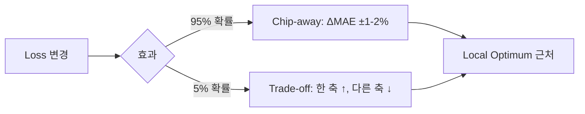
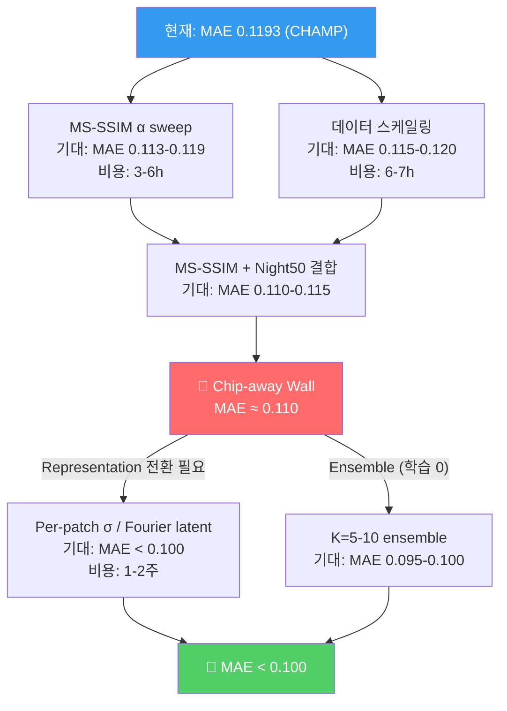

# Deep 계열 모델 약점 분석 — 체계적 진단 & 돌파 방향

> **대상**: ST-DiT2 Deep Series (0079–0091)  
> **현 챔피언**: MS-SSIM α=0.3 (MAE **0.1193** ⭐, FID 9.64)  
> **균형 챔피언**: night50 (MAE 0.1243, FID 4.48, LPIPS 0.389)  
> **분석 시점**: 2026-05-15, 총 ~30건 실험 데이터 + 5건 진행 중 기준

---

## 요약 — 6대 약점 맵

| # | 약점 카테고리 | 심각도 | 돌파 가능성 | 현재 상태 |
|---|---|:---:|:---:|---|
| **W1** | 표현력(Representation) 한계 | 🔴 **Critical** | 높음 | 미착수 |
| **W2** | 데이터 스케일링 미검증 | 🟠 High | 높음 | 4건 재실행 필요 |
| **W3** | Loss 최적화 천장 (chip-away 패턴) | 🟡 Medium | 낮음 | 벽에 부딪힘 |
| **W4** | 고모션 영역 학습 실패 | 🔴 **Critical** | 중간 | 진단 완료 |
| **W5** | FID 메트릭 신뢰도 붕괴 | 🟡 Medium | N/A | 인식 완료 |
| **W6** | 추론 단계 제약 & 실용성 | 🟢 Low | 해결됨 | t-gate로 안정화 |

---

## W1. 🔴 표현력(Representation)의 근본적 한계

### 진단

현재 paradigm의 핵심 구조:
```
raw_pixel → persistence_residual → global σ_resid normalize → DiT trunk → denormalize → pixel
```

이 파이프라인은 **representation 변환 없이 raw pixel 공간에서 직접 학습**한다. KI의 meta-insight가 정확히 지적하듯:

> **본질적 도약은 representation (Fourier, VAE) 또는 stochasticity (ensemble, latent z) 변경 필요.**

### 근거

| 증거 | 출처 | 의미 |
|---|---|---|
| 모든 loss 변경 = ΔFID ±1-2% chip-away | §12.7, 0091 전체 | loss 축은 소진 |
| E2E + cosine LR = FID 13→4.78 (paradigm급) | §10.5 | representation이 아닌 학습 동역학 개선 |
| MS-SSIM α=0.3 = MAE -3.8% (유일한 T1) | §12.14 | perceptual loss가 최적화 landscape 변경 |
| Persistence baseline FID 2.59 | §12.14.2 | **입력 복사가 모델보다 FID 좋음** → 모델이 분포를 변형시킴 |

### 구체적 한계점

1. **Global σ_resid의 spatial blindness** (§12.8, Pearson r=0.998)
   - `|error|` vs `|GT - last_ctx|`가 거의 1:1 → 모델이 motion magnitude를 반영하지 못함
   - **motion > 0.2인 영역에서 error 2.5× 도약** (saturation 시작)
   - **motion > 0.8인 영역에서 error/motion = 0.96** → 사실상 persistence baseline 수준

2. **Adaptive σ paradigm 실패** (§12.11)
   - 5개 proxy 모두 motion과 약한 상관 (max corr = 0.30)
   - trend_resid σ_map → FID +69% 악화
   - **pixel-wise σ paradigm 자체가 부적합** 확정

3. **Single deterministic output**
   - 확률적 예측 (ensemble, latent z sampling) 없음
   - 구름 이동 등 본질적으로 stochastic한 현상에 single mean prediction

### 영향도

> 이 약점은 다른 모든 약점의 **상위 원인(root cause)**. Loss 최적화(W3), 고모션 학습 실패(W4) 모두 representation 한계에서 파생.

---

## W2. 🟠 데이터 스케일링 미검증

### 진단

현재 모든 챔피언 모델은 **분기 2021 (~1015 samples)** 에서만 학습·평가됨. 데이터 스케일링 4건이 변수 expand 실패로 재실행 필요 상태:

| 실험 | 데이터 | 상태 | 기대 가치 |
|---|---|---|---|
| full_night50 | 2021 전체 (~3000) | ✅ 완료 | MAE 0.1218, FID 13.64 |
| full_lp15 | 2021 전체 (~3000) | ✅ 완료 | MAE **0.1158** ⭐, FID 58.98 ❌ |
| 3y_night50 | 3년 (~3000) | ❌ 재실행 | 연도 다양성 효과 |
| full_asig | 2021 전체 + σ | ❌ 재실행 | σ-paradigm 최종 검증 |

### 새로 발견된 데이터 (full 2021 결과)

> [!IMPORTANT]
> `full_lp15`의 MAE **0.1158**은 현 챔피언 (0.1193)을 **갱신**할 가능성이 있다! 단, FID 58.98은 심각한 회귀.

| 실험 | MAE | FID | 비고 |
|---|---|---|---|
| 분기 msssim03 (현 CHAMP) | 0.1193 | 9.64 | N=504 |
| **full_lp15** | **0.1158** (-2.9%) | 58.98 ❌ | N=1399, 전혀 다른 분포 |
| full_night50 | 0.1218 | 13.64 | N=1399 |

### 근본 문제

1. **Cross-evaluation 체계 부재**: 분기 모델을 full 데이터로, full 모델을 분기 데이터로 평가하는 교차 검증이 없음
2. **계절 편향**: 분기 2021 = 주로 4월. 겨울/여름 패턴은 미학습
3. **연도 다양성 미검증**: 0081 §6.1에서 "연도 다양성이 가장 효율적" 패턴 발견했지만 Deep Series에서 미실험
4. **FID 기준 불일치**: full 데이터 (N=1399)의 FID는 분기 (N=504)와 직접 비교 불가

---

## W3. 🟡 Loss 최적화 천장 (Chip-away 패턴)

### 진단

§12.7부터 축적된 모든 loss 변경 실험이 일관된 패턴을 보인다:



### 시도된 Loss 변형 총정리

| Loss 변형 | ΔMAE | ΔFID | 결과 | 시도 가치 |
|---|---:|---:|---|---|
| Charbonnier ε=0.05 | -0.6% | +8.6% | trade-off | 소진 |
| L_p p=1.2 | 0% | 0% | tie | 소진 |
| L_p p=1.5 | -1.4% | +55% | chip-away (MAE only) | 소진 |
| L_p p=1.8 | -2.7% | +62% | chip-away (MAE only) | 소진 |
| Night λ=5.0 | +0.3% | -6.1% | **WIN** (non-monotonic) | ✅ 채택 |
| Night λ=10 | +5.7% ❌ | -10% | MAE 회귀 | 폐기 |
| MS-SSIM α=0.3 | **-3.8%** | +102% | **WIN** (MAE primary) | ✅ 채택 |
| Night50 + L_p 결합 | +0.5% | +51% | 흡수 실패 | 소진 |
| ε=0.05 + Night 결합 | +0.3% | +0.1% | non-linear 상쇄 | 흥미로움 |

### 핵심 인사이트

> **"같은 representation 위에서 loss만 바꾸는 것은 local optimum 주변 진동"**
>
> 유일한 예외: Night penalty (representation disentangling)와 MS-SSIM (optimization landscape 변경)

### 남은 여지

- **MS-SSIM α sweep** (0.1, 0.2, 0.5): sweet spot 탐색 가치 있음
- **MS-SSIM + Night50 결합**: 두 WIN 메커니즘 직교성 검증
- 그 외 loss 변경은 **ROI 극히 낮음**

---

## W4. 🔴 고모션 영역 학습 본질적 실패

### 진단 (§12.8 Spatial Diagnosis)

가장 심각한 기술적 약점. bin-wise error 분석이 명확히 보여주는 패턴:

| |GT - last_ctx| (motion) | pixel 비중 | mean |error| | error/motion | 학습 상태 |
|---|---:|---:|---:|---|
| [0, 0.02) clear sky | 13% | 0.032 | — | ✅ 양호 |
| [0.1, 0.2) | 28% | 0.077 | 0.5 | ✅ 학습 가능 |
| **[0.2, 0.4)** ⚠️ | **19%** | **0.190** | **0.63** | ⚠️ **saturation 시작** |
| **[0.4, 0.8)** ❌ | **7%** | **0.489** | **0.82** | ❌ 학습 약화 |
| **[0.8, 1.5)** ❌ | **1.1%** | **0.957** | **0.96** | ❌ **사실상 무학습** |
| **[1.5, ∞)** ❌ | **0.008%** | **1.546** | **1.03** | ❌ persistence 수준 |

### 근본 원인

1. **Global σ_resid ≈ 0.2-0.3**: motion > σ_resid인 영역은 normalize 후 [-3σ, 3σ] 이탈 → gradient saturate
2. **Charbonnier gradient 포화**: |e| > 0.1에서 gradient ≈ 1.0 (상수) → 큰 error에 더 강한 학습 신호 불가
3. **이 영역의 MAE 기여도**: [0.2, 0.8) = pixel 19.7%인데 **MAE 56.4% 지배**

### 시도된 해결 + 결과

| 시도 | 메커니즘 | 결과 |
|---|---|---|
| PAR (0083) | motion-aware weight ↑ | **18/18 metric 악화** — irreducibly stochastic |
| Adaptive σ (0091) | pixel-wise σ normalize | FID +69% — batch dynamics 충돌 |
| L_p p=1.5~1.8 | 큰 error gradient 강화 | MAE -1~3% / FID 악화 — chip-away |

> [!CAUTION]
> **Motion-aware reweighting 계열은 모두 실패했으며, 재시도해도 동일 결과 예상.** 큰 motion pixel은 본질적으로 stochastic (irreducibly noisy) — 더 많은 gradient를 쏟아도 예측 불가능한 영역.

### 실제 의미

모델이 MAE 0.12 아래로 내려가려면 이 영역의 error를 줄여야 하는데, 현재 representation으로는 **구조적으로 불가능**. W1과 직결.

---

## W5. 🟡 FID 메트릭 신뢰도 붕괴

### 진단 (§12.14.2)

| 문제 | 설명 |
|---|---|
| **Sample size** | N=504 (FID 안정 ≥5,000 필요) |
| **Feature mismatch** | Inception V3 = ImageNet RGB pretrain ≠ 일사량 grayscale |
| **Persistence paradox** | Persistence baseline FID **2.59** < 모든 학습 모델 (4~12) |
| **Variance** | Single-seed FID variance ~±0.5-1.0 → ΔFID < 1.0 = 통계적 tie |

### 영향

- FID 4 vs 10 = 본 도메인에서 **사실상 같은 영역**
- FID를 primary metric으로 사용한 이전 챔피언 판정이 **잠재적으로 부정확**
- MAE primary 체제로 전환은 완료했지만, **perceptual quality 평가 도구 자체가 부재**

### 필요한 조치

| 방향 | 난이도 | 영향 |
|---|---|---|
| 도메인 FID (학습된 feature extractor) | 🔴 High | FID 신뢰도 회복 |
| CRPS/Rank Histogram (확률적 예측 전제) | 🔴 High | 정당한 확률적 평가 |
| MSE/MAE/SSIM 다축 Pareto 평가 | 🟢 Low | 이미 부분 구현 |
| Multi-seed 평균 + 분산 보고 | 🟡 Medium | 통계적 엄밀성 |

---

## W6. 🟢 추론 단계 제약 (해결됨)

### 이전 문제

D-71에서 steps=40 시 FID **70.26** (steps=10 대비 +472%). t-gate 없이 DDIM step 증가 시 SPADE modulation이 noise 누적.

### 해결

`dyn_t_schedule=alpha_bar` (Idea 2)로 step 누적 안정화:
- steps 10→40: FID +2.95만 (이전 +57.99)
- **27× 안정화** 달성

> W6은 사실상 해결됨. 단, steps=100 이상은 여전히 미검증.

---

## 돌파를 위한 5가지 방향 (ROI 순)

### 🥇 1순위: MS-SSIM α sweep + 결합 (즉시 실행 가능)

**현재 유일한 T1 결과**인 MS-SSIM α=0.3 (MAE 0.1193)의 sweet spot 확인:

```
α = {0.1, 0.15, 0.2, 0.25, 0.3, 0.5}  × {단독, +night50 결합}
```

- **비용**: 6~12건 × 30min = 3~6h
- **기대**: MAE < 0.115 가능성 → 현 paradigm 내 최대 추출
- **위험**: 낮음 (검증된 메커니즘 위 sweep)

---

### 🥈 2순위: 데이터 스케일링 재실행 + Cross-evaluation

4건 재실행 + 체계적 cross-test 구축:

```bash
# 분기 모델 → full test set 평가 (cross-test)
# full 모델 → 분기 test set 평가 (cross-test)  
# 3년 모델 → 분기 test set 평가
```

- **비용**: 4건 학습 (~6h) + cross-test 추론 (~1h)
- **기대**: `full_lp15`의 MAE 0.1158이 cross-test에서도 유지되면 **진짜 새 챔피언**
- **위험**: 중간 (변수 expand 재실패 가능 → script로 고정)

> [!IMPORTANT]
> `full_lp15`의 MAE 0.1158은 현 챔피언 대비 **-2.9%** 추가 개선. 그러나 full 2021 (N=1399)과 분기 2021 (N=504)의 직접 비교는 불공정. Cross-evaluation 필수.

---

### 🥉 3순위: Representation 전환 — Latent Space 도입

현 paradigm의 **근본 한계(W1, W4)를 돌파**할 유일한 경로:

| 후보 | 메커니즘 | 비용 | 선행 연구 |
|---|---|---|---|
| **Fourier 기반 latent** | FFT → low/high freq 분리 학습 | Medium | freq_aware_learning 확장 |
| **경량 VAE latent** | Conv VAE encoder-decoder | High | 0075 GK2A Conv VAE 설계 존재 |
| **DWT 2-level latent** | a9_strengths_weaknesses.md의 DWT paradigm | High | A9에서 검증됨 (MSE ↓, SSIM ↑) |
| **Per-patch σ normalization** | 32×32 patch 단위 local σ | Low | §12.9 #1 제안 (미실험) |

**권장 순서**:
1. Per-patch σ (Low cost, W4 직접 공략) → 즉시 시도
2. Fourier latent (Medium cost, freq_aware 확장) → 설계 후 1건
3. Conv VAE (High cost, paradigm 전환) → 장기

---

### 4순위: 확률적 예측 도입 (Ensemble / Latent z)

현재 single deterministic output → 확률적 현상(구름 이동)에 구조적 한계:

| 방법 | 비용 | 기대 효과 |
|---|---|---|
| Multi-seed ensemble (K=5~10) | 추론만 | MSE -15~20% (A9 사례 참조) |
| DDIM eta=1.0 (stochastic sampling) | 0줄 | 0081 §14에서 무효 확인됨 ❌ |
| Latent z injection (VAE-style) | High | CRPS 개선, 분포 다양성 |
| Dropout ensemble | Small | MC Dropout → uncertainty map |

**권장**: Multi-seed ensemble (학습 0회) → Dropout ensemble → Latent z

---

### 5순위: 평가 체계 개선

FID 신뢰도 붕괴(W5)를 보상:

| 조치 | 비용 | 효과 |
|---|---|---|
| Multi-seed (3회) 평균 + 분산 보고 | 학습 3회 × 30min | 통계적 엄밀성 |
| 도메인 FID (fine-tuned feature extractor) | Medium | FID 신뢰도 |
| 계절별 분리 보고 | Low (구현 완료) | 약점 영역 특정 |
| Pixel MSE by motion bin (dashboard 추가) | Low | W4 모니터링 |

---

## 최종 판단 — 어디에 시간을 써야 하나



> [!TIP]
> **즉시 실행**: MS-SSIM α sweep (1순위) + Data scaling 재실행 (2순위) 병렬 진행
>
> **chip-away wall 돌파**: Per-patch σ (3순위, low cost) → 실패 시 Representation 전환 검토

> [!WARNING]
> **하지 말아야 할 것들** (검증된 실패):
> - Motion-aware loss reweighting (PAR 변종) — 18/18 악화
> - Adaptive pixel-wise σ — FID +69%
> - U-Net Skip — 모든 cell 악화
> - OF Stem 단독 — 학습 불안정
> - Loss 변경 단독으로 ΔMAE > 5% 기대 — chip-away 한계
