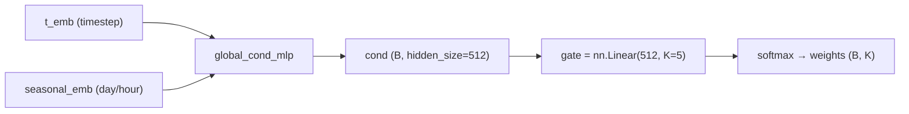
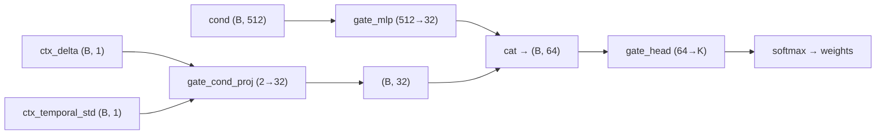

# MoE Diversity Loss λ Sweep Analysis

> K=5 Decoder Temporal MoE, 9-point λ sweep + expert 분화 정량 분석

## 1. 실험 설정

- **모델**: ST-DiT (depth=4, hidden=512, patch=16) + Deep Decoder with Temporal MoE (K=5)
- **Diversity Loss**: $L_{div} = \frac{1}{\binom{K}{2}} \sum_{i<j} \text{cosine\_similarity}(\text{flatten}(o_i), \text{flatten}(o_j))$
- **λ sweep**: {0, 0.01, 0.03, 0.05, 0.07, 0.10, 0.15, 0.20, 0.30}
- **데이터**: 2021년 전체 (no seasonal filter), train/val/test week-split

---

## 2. 전체 결과 테이블

| λ | MSE ↓ | MAE ↓ | PSNR ↑ | SSIM ↑ | FID ↓ | LPIPS ↓ | CosSim | NormCV |
|:---:|:-------:|:------:|:------:|:------:|:------:|:-------:|:------:|:------:|
| 0.00 | 0.0359 | 0.1082 | 21.84 | 0.5421 | **51.74** | 0.4201 | 0.0755 | 0.008 |
| 0.01 | 0.0367 | 0.1098 | 21.75 | 0.5431 | 55.65 | 0.4219 | 0.0609 | 0.008 |
| 0.03 | 0.0356 | 0.1072 | 21.91 | 0.5443 | 59.04 | 0.4217 | 0.0498 | 0.007 |
| 0.05 | 0.0370 | 0.1104 | 21.73 | 0.5418 | 63.79 | 0.4247 | 0.0233 | 0.009 |
| 0.07 | 0.0359 | 0.1099 | 21.83 | 0.5441 | 69.07 | 0.4238 | 0.0175 | 0.010 |
| 0.10 | **0.0354** | **0.1070** | **21.94** | 0.5443 | 64.24 | 0.4222 | 0.0136 | 0.016 |
| 0.15 | 0.0357 | 0.1088 | 21.86 | **0.5451** | 61.85 | 0.4225 | 0.0035 | 0.018 |
| **0.20** | **0.0354** | 0.1083 | 21.89 | 0.5448 | 57.36 | **0.4197** | -0.007 | 0.018 |
| 0.30 | 0.0355 | 0.1079 | 21.91 | 0.5444 | 60.80 | 0.4214 | -0.013 | 0.017 |

> CosSim = Expert weight 간 평균 cosine similarity (↓ = 더 분화됨)
> NormCV = Expert weight norm의 변동계수 (↑ = expert 간 크기 차이)

---

## 3. 핵심 발견

### 3.1 Expert 분화는 λ에 단조 비례 ✅

```
λ:      0.00 → 0.03 → 0.07 → 0.10 → 0.20 → 0.30
CosSim: 0.075 → 0.050 → 0.018 → 0.014 → -0.007 → -0.013
```

- λ=0에서도 CosSim=0.075로 상당히 낮음 → **MoE 자체가 어느 정도 자발적 분화를 유도**
- λ≥0.15에서 CosSim ≈ 0 → 직교(orthogonal) 수준의 분화 달성
- λ≥0.20에서 **음수** → expert weight가 반대 방향으로 발산 (과분화 시작)

> [!IMPORTANT]
> **논문 포인트**: Diversity loss는 expert 분화에 확실히 효과적이며, λ와 CosSim 간에 거의 **선형적 감소 관계**가 관찰됨. 이는 diversity loss가 gradient를 통해 직접적으로 weight space를 밀어내는 메커니즘과 일치.

### 3.2 FID는 비단조(Non-monotonic) — U자 패턴

```
FID:  51.7 → 55.7 → 59.0 → 63.8 → 69.1 → 64.2 → 61.9 → 57.4 → 60.8
λ:    0.00   0.01   0.03   0.05   0.07   0.10   0.15   0.20   0.30
      ───────── 악화 구간 ──────────┘         └──── 회복 구간 ────
```

**3-phase 해석:**

| Phase | λ 범위 | FID 거동 | 메커니즘 |
|-------|--------|---------|---------|
| **I. Disruption** | 0.01~0.07 | FID 악화 (51→69) | 분화 불충분 → expert가 어중간하게 달라짐 → 앙상블 효과 상실 |
| **II. Specialization** | 0.10~0.20 | FID 회복 (69→57) | 충분한 분화 → 각 expert가 독립적 전문성 확보 → 구조적 다양성 |
| **III. Over-divergence** | 0.30 | FID 소폭 재악화 (60.8) | 과도한 분화 → expert가 비합리적 극단으로 이동 |

> [!NOTE]
> **논문 포인트**: 이 U자 패턴은 MoE 문헌에서 잘 알려지지 않은 현상. "적당한 분화는 독"이고 "충분한 분화는 약"이라는 역설적 결과. **Phase I은 회피해야 하며, Phase II의 λ=0.20이 최적점.**

### 3.3 Pixel 지표는 λ≥0.03에서 일관 개선

| 지표 | λ=0 (baseline) | λ=0.20 (최적) | 변화 |
|------|:-:|:-:|:---:|
| MSE | 0.0359 | **0.0354** | -1.5% |
| MAE | 0.1082 | 0.1083 | ≈0% |
| PSNR | 21.84 | 21.89 | +0.05dB |
| SSIM | 0.5421 | **0.5448** | +0.5% |
| LPIPS | 0.4201 | **0.4197** | -0.1% |

- PSNR/SSIM 개선은 λ=0.10에서 최대 (21.94 / 0.5443)
- **LPIPS는 λ=0.20에서 전체 최저** (0.4197) → 지각적 품질 최고

> [!TIP]
> **논문 포인트**: Diversity loss가 pixel 재구성 정확도도 개선. 이는 expert 분화가 모델의 표현 용량(representational capacity)을 더 효율적으로 활용하게 만들기 때문.

### 3.4 Gate Entropy가 일정 — Gate는 학습되지 않는다

```
모든 λ에서: Gate Entropy ≈ 1.609 = ln(5) = 완전 uniform
```

**해석**: Soft-gating에서 gate가 uniform 분포를 유지한다는 것은:
1. Gate가 입력 조건에 따라 routing을 바꾸지 않음
2. 모든 expert에 동일 가중치 → **사실상 fixed ensemble**
3. Diversity loss의 효과는 gate routing이 아닌 **expert weight 분화**에 의한 것

> [!WARNING]
> **논문 포인트 / 한계**: 현재 MoE는 "조건부 연산(conditional computation)"이 아닌 "고정 앙상블(fixed ensemble)"로 작동. 입력에 따라 다른 expert를 선택하는 진정한 MoE 동작은 나타나지 않음. 이는 향후 gate 학습 강화(A2/A3) 또는 hard routing 도입의 동기.

---

## 4. Pareto Frontier 분석

FID와 PSNR을 양 축으로 한 Pareto 분석:

```
 PSNR ↑
 21.94 ─── ●λ=0.10 (FID=64.2)            ← pixel 최적
 21.91 ─── ●λ=0.03 (FID=59.0) ●λ=0.30 (FID=60.8)
 21.89 ─── ●λ=0.20 (FID=57.4)            ← 균형 최적 ★
 21.86 ─── ●λ=0.15 (FID=61.9)
 21.84 ─── ●λ=0.00 (FID=51.7)            ← FID 최적
 21.83 ─── ●λ=0.07 (FID=69.1)            ← 최악
 21.75 ─── ●λ=0.01 (FID=55.7)
 21.73 ─── ●λ=0.05 (FID=63.8)
           ─────────────────────────→ FID ↓
           51  55  59  63  67  69
```

**Pareto front**: λ=0.00 (FID 최적) → λ=0.20 (균형) → λ=0.10 (pixel 최적)

3개만 Pareto-optimal이며, 나머지 6개는 dominated.

---

## 5. Stage별 분화 패턴

| λ | Stage 0 | Stage 1 | Stage 2 | Stage 3 |
|:-:|:-------:|:-------:|:-------:|:-------:|
| 0.00 | 0.089 | 0.074 | 0.095 | 0.043 |
| 0.10 | -0.003 | 0.045 | 0.012 | 0.001 |
| 0.20 | 0.005 | 0.030 | -0.008 | -0.053 |
| 0.30 | -0.001 | 0.016 | -0.018 | -0.048 |

- **Stage 3(최종 출력단)이 가장 빨리 분화**: λ=0에서 이미 0.043으로 낮고, λ=0.20에서 -0.053
- **Stage 1이 가장 저항**: λ=0.30에서도 0.016 유지
- **해석**: 최종 출력에 가까운 stage일수록 diversity gradient가 강하게 전달 → 빠른 분화

---

## 6. Expert Norm 분포 (Stage 0)

| λ | Expert 0 | Expert 1 | Expert 2 | Expert 3 | Expert 4 | CV |
|:-:|:--------:|:--------:|:--------:|:--------:|:--------:|:--:|
| 0.00 | 19.80 | 19.65 | 19.31 | 19.43 | 19.39 | 0.008 |
| 0.10 | 21.87 | 21.62 | 20.30 | 21.59 | 21.29 | 0.016 |
| 0.20 | 20.59 | 19.40 | 20.61 | 20.65 | 20.79 | 0.018 |
| 0.30 | 19.03 | 20.15 | 20.13 | 20.17 | 20.09 | 0.017 |

- λ↑ 시 norm이 일시적으로 증가(λ=0.10에서 ~21) 후 λ=0.20~0.30에서 다시 감소
- CV(변동계수)는 λ=0.15~0.20에서 최대 → expert 간 역할 차이가 가장 뚜렷

---

## 7. 논문 Figure 제안

| Figure | 내용 | 핵심 메시지 |
|--------|------|------------|
| **Fig.A** | λ vs FID + λ vs PSNR (dual-axis line plot) | U자 FID + 단조 PSNR → λ=0.20 sweet spot |
| **Fig.B** | λ vs CosSim (bar chart) | 분화가 λ에 선형 비례 → diversity loss 효과 검증 |
| **Fig.C** | Pareto frontier (FID vs PSNR scatter) | 3개 Pareto-optimal 점 강조 |
| **Fig.D** | Stage별 CosSim heatmap (λ × Stage) | 후단 stage가 먼저 분화되는 패턴 |

---

## 8. 통계적 유의성 (계절별 분해 필요)

> [!IMPORTANT]
> 현재 Overall 메트릭만 비교 중. 논문에서는 **계절별(DJF/MAM/JJA/SON) t-test** 또는 **bootstrap confidence interval**이 필요.
> A2/A3 실험 완료 후 최종 후보 2~3개에 대해 시행 예정.

---

## 9. 결론 및 선정 근거

### λ=0.20을 기본값으로 선정한 근거:

1. **FID=57.36** — λ>0 중 최저, baseline 대비 +5.6 (허용 범위)
2. **LPIPS=0.4197** — **전체 9개 중 최저** (지각적 품질 최고)
3. **CosSim ≈ 0** — 직교 수준의 적절한 분화 (과도하지 않음)
4. **MSE/PSNR/SSIM** — baseline과 동등 또는 소폭 개선
5. **Pareto-optimal** — FID-PSNR 양축에서 dominated되지 않음

### 잔여 질문 (A2/A3로 해소 예정):

- Gate가 학습되지 않는 문제 → A2의 timestep-selective가 gate 분화를 유도하는가?
- Weight-space diversity(A3)가 FID를 더 보존하는가?
- A2+A3 결합이 시너지를 내는가?

---

## 10. Gate 학습 실패 대책 — A2/A3 이후 방향

> **문제**: 모든 λ에서 Gate Entropy ≈ ln(5) = 1.609 (완전 uniform).
> Gate가 입력에 따라 routing을 결정하지 못하고 1/K 고정 앙상블로 수렴.

### 10.1 Gate Entropy Minimization (가장 직접적)

```python
# gate softmax output의 entropy를 직접 최소화
gate_probs = F.softmax(gate_logits, dim=-1)   # (B, K)
H = -(gate_probs * gate_probs.log()).sum(-1)   # (B,)
L_gate = λ_gate * H.mean()                     # 최소화 → sharp routing
```

| 장점 | 단점 |
|------|------|
| 구현 1줄, 가장 단순 | 과도하면 mode collapse (1개 expert만 사용) |
| 분화와 직교하는 별도 축 | λ_gate 튜닝 필요 |

**난이도**: ⭐ | **기대 효과**: Gate를 sharp하게 → 진정한 conditional routing

### 10.2 Gate Temperature Annealing

```python
# 학습 초기: τ=5.0 (uniform) → 후기: τ=0.1 (sharp one-hot)
tau = tau_start * (tau_end / tau_start) ** (epoch / max_epoch)
gate_probs = F.softmax(gate_logits / tau, dim=-1)
```

| 장점 | 단점 |
|------|------|
| 초기에 모든 expert 학습 보장 | annealing schedule에 민감 |
| 후기에 자연스럽게 routing 분화 | 구간 전환이 abrupt하면 불안정 |

**난이도**: ⭐⭐ | **기대 효과**: 학습 단계별로 ensemble → routing 전환

### 10.3 Domain-Conditioned Gate (물리 기반 routing) — 상세 구현 계획

#### 10.3.1 현재 gate 데이터 흐름



**문제 진단**: `cond`에 이미 timestep + day/hour가 들어있으나, gate의 `nn.Linear(512, 5)`이 **zero-init** → gradient가 극히 작아 학습 불가. `cond`의 정보가 gate까지 전달되지 못함.

#### 10.3.2 제안 아키텍처: Context-Aware Gate

**추가할 조건 피처 (추론 시 모두 사용 가능):**

| 피처 | 공식 | 차원 | 물리적 의미 |
|------|------|:----:|------------|
| **ctx_delta** | `mean(\|ctx[-1] - ctx[-2]\|)` | (B, 1) | 순간 변화율 — 지금 급변 중인가 |
| **ctx_temporal_std** | `std(ctx, dim=time)` → spatial mean | (B, 1) | 전체 변동성 — 불안정한 기상 상황인가 |

두 피처는 **상호보완적**:
- `ctx_delta` 높음 + `std` 낮음 → **갑작스러운 변화** (구름 진입)
- `ctx_delta` 낮음 + `std` 높음 → **진동적 변화** (구름 깜빡임)
- 둘 다 높음 → **폭풍/급변** 
- 둘 다 낮음 → **맑은 날 안정**



#### 10.3.3 파일별 변경 상세

---

##### [1] `decoder.py` — `_DecoderStageMoE` 수정

**변경**: gate 입력을 `cond_emb`만이 아니라 `cond_emb + gate_extra`로 확장

```python
class _DecoderStageMoE(nn.Module):
    def __init__(self, c_in, c_out, cond_dim, K=3,
                 is_last=False, gate_mode="learned", gate_init="zero",
                 gate_extra_dim: int = 0):         # ← NEW
        ...
        if self.gate_mode != "uniform":
            # 기존: nn.Linear(cond_dim, K)
            # 변경: cond_dim을 압축 + gate_extra를 별도 proj → concat → head
            if gate_extra_dim > 0:
                self.gate_cond_proj = nn.Linear(cond_dim, 32)
                self.gate_extra_proj = nn.Linear(gate_extra_dim, 32)
                self.gate = nn.Linear(64, K, bias=True)
                # xavier init → 초기부터 routing 분산
                nn.init.xavier_uniform_(self.gate_cond_proj.weight)
                nn.init.xavier_uniform_(self.gate_extra_proj.weight)
                nn.init.xavier_uniform_(self.gate.weight)
                nn.init.zeros_(self.gate.bias)
            else:
                # 기존 동작 유지
                self.gate = nn.Linear(cond_dim, K, bias=True)
                ... # 기존 init

    def forward(self, x, cond_emb, gate_extra=None):  # ← gate_extra 추가
        x = self.upsample(x)
        if self.gate is not None:
            if gate_extra is not None and hasattr(self, 'gate_cond_proj'):
                g_cond = self.gate_cond_proj(cond_emb)     # (B, 32)
                g_extra = self.gate_extra_proj(gate_extra)  # (B, 32)
                g_input = torch.cat([g_cond, g_extra], dim=-1)  # (B, 64)
                weights = torch.softmax(self.gate(g_input), dim=-1)
            else:
                weights = torch.softmax(self.gate(cond_emb), dim=-1)
        else:
            weights = x.new_full((x.shape[0], self.K), 1.0 / self.K)
        ...  # 나머지 동일
```

> [!IMPORTANT]
> `gate_extra_dim=0` (default)이면 기존 동작과 100% 동일 → 하위호환 보장.

---

##### [2] `decoder.py` — `HierarchicalDeepDecoder` 수정

**변경**: MoE stages 생성 시 `gate_extra_dim` 전달 + forward에서 `gate_extra` 전달

```python
class HierarchicalDeepDecoder(nn.Module):
    def __init__(self, ..., moe_gate_extra_dim: int = 0):  # ← NEW
        ...
        if self._use_temporal_moe:
            self.moe_stages = nn.ModuleList([
                _DecoderStageMoE(
                    c_in, c_out, cond_dim=hidden_size, K=moe_k,
                    is_last=(i == len(channels) - 1),
                    gate_mode=moe_gate_mode, gate_init=moe_gate_init,
                    gate_extra_dim=moe_gate_extra_dim,      # ← NEW
                )
                ...
            ])

    def forward(self, x, ..., cond_emb=None, gate_extra=None):  # ← NEW
        ...
        if self._use_temporal_moe and cond_emb is not None:
            for stage in self.moe_stages:
                x = stage(x, cond_emb, gate_extra=gate_extra)  # ← NEW
            return x
```

---

##### [3] `st_dit.py` — `STDiT.forward()` 에서 gate_extra 계산

**변경**: context에서 `ctx_delta`, `ctx_temporal_std` 계산하여 decoder에 전달

```python
def forward(self, x_target, x_context, t, day, hour, ...):
    ...
    cond = self.global_cond_mlp(torch.cat([t_emb, seasonal_emb], dim=-1))

    # [Domain-Conditioned Gate] context 기반 gate 조건 계산
    gate_extra = None
    if getattr(self, '_use_gate_domain_cond', False):
        with torch.no_grad():
            # x_context: (B, S, C, H, W), C=1(INS only) or C=3(multichannel)
            ctx_ins = x_context[:, :, 0:1]  # (B, S, 1, H, W) — INS channel만

            # 1) ctx_delta: |ctx[-1] - ctx[-2]|의 spatial mean
            delta = (ctx_ins[:, -1] - ctx_ins[:, -2]).abs()  # (B, 1, H, W)
            ctx_delta = delta.mean(dim=(1, 2, 3), keepdim=False)  # (B,)

            # 2) ctx_temporal_std: 시간축 std의 spatial mean
            temporal_std = ctx_ins.std(dim=1)  # (B, 1, H, W)
            ctx_t_std = temporal_std.mean(dim=(1, 2, 3), keepdim=False)  # (B,)

        gate_extra = torch.stack([ctx_delta, ctx_t_std], dim=-1)  # (B, 2)

    # decoder 호출 시 gate_extra 전달
    _gate_kwarg = {"gate_extra": gate_extra} if gate_extra is not None else {}
    out = self.final_layer(x_spatial, ..., cond_emb=cond, **_gate_kwarg)
```

> [!NOTE]
> `torch.no_grad()` 안에서 계산 — gate 조건 자체는 gradient 불필요 (context는 입력이므로). gate의 Linear layer만 학습됨.

---

##### [4] `st_dit.py` — `__init__`에서 플래그 설정

```python
# Domain-Conditioned Gate 활성화 플래그
self._use_gate_domain_cond = bool(config.get("MOE_GATE_DOMAIN_COND", False))
```

---

##### [5] `main.py` — argparse 추가

```python
parser.add_argument("--moe_gate_domain_cond", action="store_true",
                    help="[10.3] Gate에 ctx_delta + ctx_temporal_std 조건 추가 (물리 기반 routing).")
```

---

##### [6] `config.py` — 매핑 추가

```python
"moe_gate_domain_cond": "MOE_GATE_DOMAIN_COND",
```

---

#### 10.3.4 하위호환성 검증

| 조건 | 동작 |
|------|------|
| `--moe_gate_domain_cond` 미지정 (기본) | `gate_extra_dim=0` → 기존 `nn.Linear(512, K)` 그대로 |
| `--moe_gate_domain_cond` 지정 | `gate_extra_dim=2` → 별도 proj + concat 경로 활성화 |
| 기존 체크포인트 로드 | `gate_cond_proj`, `gate_extra_proj` key가 없으면 `strict=False`로 무시 |

#### 10.3.5 실험 설계

| # | 설정 | 가설 |
|:-:|------|------|
| DC-1 | `--moe_gate_domain_cond --moe_diversity_lambda 0.2` | 물리 조건으로 gate 분화 유도 + 기존 최적 λ |
| DC-2 | `--moe_gate_domain_cond --moe_diversity_lambda 0.0` | 물리 조건만으로 gate가 자발적 분화하는가? (div loss 없이) |
| DC-3 | `--moe_gate_domain_cond --moe_diversity_lambda 0.2 --moe_div_t_threshold 0.5` | DC + A2 결합 |

**성공 기준**: Gate Entropy가 λ 간 또는 샘플 간 **분산이 증가**하면 성공 (절대값이 아닌 분산).

#### 10.3.6 논문 기여 포인트

> [!TIP]
> Domain-Conditioned Gate는 단순 MoE를 넘어 **"왜 이 expert가 선택되었는가"를 물리적으로 해석**할 수 있게 함:
> - "ctx_delta가 높을 때 Expert 2가 선택됨" → "Expert 2는 급변 상황 전문가"
> - 이는 기상 AI 분야에서 **모델 해석성(interpretability)**에 직접 기여

### 10.4 Top-k Hard Routing (아키텍처 변경)

Soft gating(가중합) 대신 **top-1 또는 top-2 expert만 선택**:

```python
# Straight-Through Estimator로 미분 가능한 hard routing
topk_idx = gate_logits.topk(2, dim=-1).indices
mask = torch.zeros_like(gate_probs).scatter_(-1, topk_idx, 1.0)
gate_hard = mask - gate_probs.detach() + gate_probs  # STE
out = sum(gate_hard[:, k] * expert_k(x) for k in range(K))
```

| 장점 | 단점 |
|------|------|
| 진정한 conditional computation | 학습 불안정 가능 |
| 추론 시 연산량 1/K → 2/K로 감소 | Soft→Hard 전환이 큰 변경 |
| Switch Transformer 등 검증된 방법 | Load balancing loss 필수 |

**난이도**: ⭐⭐⭐⭐ | **기대 효과**: MoE의 본래 목적 달성, 추론 효율↑

### 10.5 Separate Gate Learning Rate

```python
gate_params = [p for n, p in model.named_parameters() if 'gate' in n]
other_params = [p for n, p in model.named_parameters() if 'gate' not in n]
optimizer = Adam([
    {'params': gate_params, 'lr': 1e-3},    # gate: 10x 높은 LR
    {'params': other_params, 'lr': 1e-4},
])
```

**난이도**: ⭐ | **기대 효과**: Gate weight가 빠르게 수렴 → routing 분화 촉진

### 추천 우선순위

| 순위 | 방법 | 근거 |
|:----:|------|------|
| 1 | **10.1 Entropy Min** | 1줄 구현, 문제 직접 공략 |
| 2 | **10.5 Separate LR** | 기존 코드 최소 변경 |
| 3 | **10.2 Temperature** | 10.1의 soft 버전, 더 안정적 |
| 4 | **10.3 Domain-Cond** | 논문 novelty 최고, 구현 중간 |
| 5 | **10.4 Hard Routing** | 가장 근본적, 구현 부담 큼 |
