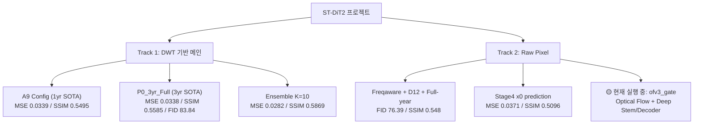

# ST-DiT2 실험 현황 종합 보고서 (2026-05-13)

## 1. 프로젝트 개요

**목표**: GK-2A 위성 일사량(SSI) 예측을 위한 Diffusion Transformer — AC U-Net (IEEE GRSL 2025) 대비 동등 이상의 성능 달성

---

## 2. 현재 SOTA 성능 vs 목표

### 2.1 DWT 기반 메인 파이프라인 (ST-DiT)

| 지표 | AC U-Net (30min) | **A9 (1yr)** | **Ens K=10** | **P0_3yr_Full** | 목표 | 달성 여부 |
|------|:---:|:---:|:---:|:---:|:---:|:---:|
| **MSE** ↓ | 0.0250 | 0.0339 | **0.0282** ✅ | 0.0338 | ≤ 0.030 | ✅ (Ensemble) |
| **MAE** ↓ | — | 0.1102 | 0.1020 | 0.1079 | — | — |
| **SSIM** ↑ | 0.6220 | 0.5495 | 0.5869 | 0.5585 | ≥ 0.60 | ❌ 미달 |
| **PSNR** ↑ | 23.28 dB | 21.81 dB | **22.59 dB** ✅ | 21.99 dB | ≥ 22.0 dB | ✅ (Ensemble) |
| **FID** ↓ | — | 261.41 | 302.89 | **83.84** | — | — |
| **LPIPS** ↓ | — | 0.5952 | 0.5928 | **0.5373** | — | — |

> [!IMPORTANT]
> **MSE/PSNR 목표는 Ensemble K=10으로 달성**했으나, **SSIM ≥ 0.60 목표는 아직 미달** (최고 0.5869).
> FID는 3yr Full 학습(83.84)에서 가장 우수.

### 2.2 Raw Pixel 파이프라인 (Stage 4/5 — 보조 실험 트랙)

| 모델 | MSE | SSIM | FID | 비고 |
|---|:---:|:---:|:---:|---|
| Stage4_RawPixel_D4_P16_x0 | **0.0371** | **0.5096** | 189.33 | x0 prediction, **Raw Pixel 최고** |
| Stage5_HomoMoE4K2_D8 | 0.0469 | 0.4667 | — | Depth-Homo MoE |
| Stage4_Resid_MoE8K2_D4 | 0.0537 | 0.4473 | 173.31 | Hetero MoE + Residual |

---

## 3. 확정된 최적 Config

### A9 (1yr Prototyping Default) ★

```
B1_BG (BrightnessGate, bias=-3.0) + Huber Loss (δ=0.1)
+ DWT 2-level + Hetero MoE 8E top-k=2 + BayesShrink
+ Per-Channel SNR + AdaLN + Cosine LR
```

- **체크포인트 (1yr)**: `models_dit/P13_A9_B1BG_Huber/best_st_dit.pt`
- **체크포인트 (3yr SOTA)**: `models_dit/Final_P0_3yr_Full_D4/best_st_dit.pt`

---

## 4. 현재 실행 중인 실험

### 4.1 GPU 상태

| GPU | 모델 | VRAM 사용 | 활용률 |
|---|---|---:|---:|
| H200 NVL (143GB) | 사용 가능 (18GB/143GB) | 12.6% | 0% |

### 4.2 실행 중 프로세스

```
FullData2021_d4p32_deepstem_deepdec_charbonnier_ofv3_gate
 └─ Raw Pixel, x0 prediction, depth=4, patch=32
 └─ Deep Stem + Deep Decoder + Charbonnier Loss
 └─ Optical Flow (v3, gate, uncertainty weighting)
 └─ Freq-aware Learning + Spatial Expert
 └─ 10개 worker 프로세스 (DDP)
```

> 이것은 **Raw Pixel 파이프라인의 Optical Flow 게이트 실험**으로, DWT 기반 메인 파이프라인과는 별도 트랙.

---

## 5. 완료된 Phase 요약 (총 15+ Phase, 100+ 실험)

| Phase | 핵심 결론 | 상태 |
|:---:|:---|:---:|
| 1 | Neural IDWT 폐기 (Alpha 활성화 역설) | ✅ |
| 2 | AdaLN / Per-Ch SNR / BayesShrink 채택. Pixel Loss 전원 실패 (W^TW 편향) | ✅ |
| 3-A | Hetero Expert MoE 9G(8E+k=2) 4관왕 / Dense/EMA 비채택 | ✅ |
| Ablation 1-2 | DWTBias + AuxL1(l1) 채택. DWT 물리피처/아키텍처 혁신 전원 비채택 | ✅ |
| P0 | AuxL1+DWTBias = SSIM 0.5307, MSE 0.0378 확립 | ✅ |
| 4-6 | PhysClamp/W++/EDM/DWTCtxStats/CrossTrack/Noise schedule 전원 비채택 | ✅ |
| P0-Final | **P0_3yr_Full: MSE 0.0338, SSIM 0.5585, FID 83.84** — 3yr 역대 최고 | ✅ |
| 11 | BrightnessGate(bias=-3.0) P0 초과. 3yr에서는 효과 소실 | ✅ |
| 12 | H200 11건 sweep — Huber MSE 1위, AuxL1_B2 SSIM 1위 | ✅ |
| **13** | **A9(B1_BG+Huber) 1yr 3관왕. 1yr default 격상** | ✅ |
| 14 | Spatial Brightness Gate 6-way 비교 (OOM 대응 v2 적용) | 🟡 |
| **15** | **표면 RQ 입증 + MSE/SSIM 개선 통합 Phase** | 🟡 |

---

## 6. 미완료 핵심 작업 (우선순위별)

### P0 (최우선)

| ID | 작업 | 상태 | 비고 |
|:---:|---|:---:|---|
| 15.E4 | **Ensemble K=10 + Heun + gs=1.0 Stack** | ⬜ | thesis main 결과 후보. ~2h |
| 15.E5 | **LPIPS aux loss** (=Phase 13.9) | ⬜ | blocking 해제됨. SSIM gap 해소 핵심 |
| 15.E15 | **D/H 양방향 sweep** (D2/D3/D6, H256/H384) | 🟡 | D1/D2 완료, Depth 축소 시 악화 확인 |
| 15.A1-b/c | **VAE-DiT baseline** (SD-VAE / GK-2A VAE) | ⬜ | 표면 RQ 논리 입증 필수 |
| 15.C1-C2 | **Thesis narrative 정합성** | ⬜ | 글쓰기 only |
| 15.E22 | **RQ3 수치 불일치 정정** (1,746 vs 3,455) | ⬜ | 학습 0, 분석만 |
| T-G/T-H | **BrightnessGate / Curriculum 분석 thesis 서술** | ⬜ | Methodology 보강 |

### P1

| ID | 작업 | 상태 | 비고 |
|:---:|---|:---:|---|
| 15.E3b | Heun 10/20-step (NFE=20/40) | ⬜ | Heun 5-step 우수 확인 → step 증가 ROI 높음 |
| 15.E23 (α) | CVE-Pix Loss (자체 개발 모듈) | ❌ Fine-tune 비채택 | scratch 재실행 고려 |
| 15.E23b (β) | TS-DCSI 단독 ablation | ⬜ | BiDirCrossScale thesis 자체 모듈 격상 |
| 15.E23c (β') | AFS-MoE 단독 ablation | ⬜ | LF/HF MoE 비대칭 설계 자체성 입증 |
| 15.E27 | HF loss boost 학습 | ❌ 비채택 | scratch SSIM -2.2% |
| 15.B1 | W/m² 단위 도메인 지표 재계산 | ⬜ | 학습 0 |

### 비채택 확정된 시도들 (최근)

| 시도 | 결과 | 사유 |
|---|---|---|
| 15.E21 Context HF path | MSE +8.8%, SSIM -8.3% | HF는 sample-level noise dominate |
| 15.E27 HF loss mult | SSIM -2.2% | HF 과강조 비효과 |
| 15.E23 CVE-Pix Fine-tune | MSE +7.1%, SSIM -5.3% | Fine-tune 방식 한계 |
| 15.E7 HF-D Fine-tune | MSE +38.3%, SSIM -29.4% | GAN 불균형 |
| DPM-Solver++ | SSIM -2.0% | 추론 기법으로 HF 해결 불가 |
| PSD 에너지 보정 | SSIM -1.4% | 동상 |

---

## 7. 두 실험 트랙 비교



---

## 8. 실험 규모 통계

| 항목 | 수치 |
|---|---:|
| test_results_v2.csv 총 행수 | 336 |
| 학습된 모델 디렉토리 (models_dit) | 96 |
| 문서 (docs/) | 114+ |
| 완료된 Phase | 15+ |
| Leaderboard 등재 실험 | 16 |
| 서버 | H200 NVL (현재), A6000 (이전 주력) |

---

## 9. 핵심 판단 포인트

> [!WARNING]
> ### SSIM ≥ 0.60 목표 미달
> 현재 최고 SSIM은 Ensemble K=10의 **0.5869** (목표 대비 -2.2%p). 
> 단일 모델 최고는 P0_3yr_Full의 **0.5585**.
> **LPIPS aux loss (15.E5)** 또는 **HF-D scratch 학습 (15.E7)** 등 perceptual prior 주입이 핵심 과제.

> [!NOTE]
> ### VAE-DiT 비교 부재
> 논문의 표면 RQ "기존 VAE 기반 DiT의 단점 해결"에 대한 **직접 비교군(15.A1-b/c)이 미실행**.
> Conv VAE-DiT (SSIM 0.5826)와 KL VAE-DiT (FID 202.74) 예비 결과만 존재.
> Defense 전 **반드시 완료** 필요.

> [!TIP]
> ### 즉시 실행 가능한 고ROI 작업
> 1. **15.E4** (Heun + K=10 + gs=1.0 Stack) — 학습 0, thesis main 결과 후보 (~2h)
> 2. **15.E5** (LPIPS aux loss) — blocking 해제, SSIM gap 핵심 대응
> 3. **15.E22** (RQ3 수치 정정) — 학습 0, defense 필수 사항

---

## 10. Raw Pixel 트랙 (L40S/H200 documents 기반) 현황

docs/0078에 따르면 Raw Pixel 트랙의 **현재 챔피언**:

| 모델 | MSE | SSIM | FID |
|---|:---:|:---:|:---:|
| **D12P16_steps10** (freqaware) | 0.0363 | 0.548 | **76.39** |
| freqaware_baseline_steps10 | **0.0358** | — | 94.0 |
| P3-3 IR σ_resid | 0.0498 | 0.490 | 98.63 |

현재 실행 중인 `ofv3_gate`는 Optical Flow 기반 게이트 + Deep Stem/Decoder 구조 실험.
P3-3 (IR σ_resid)와 freqaware의 직교 결합이 다음 큰 step으로 권고됨.
