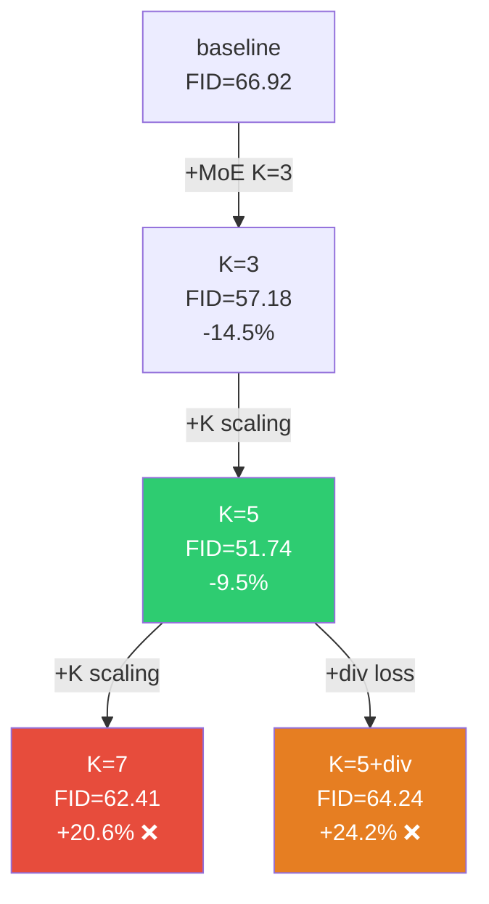

# MoE Expert Scaling & Diversity — 실험 종합 분석

## 전체 실험 결과

| 모델 | K | Diversity | MSE ↓ | MAE ↓ | PSNR ↑ | SSIM ↑ | FID ↓ | LPIPS ↓ |
|------|:-:|:---------:|:-----:|:-----:|:------:|:------:|:-----:|:-------:|
| baseline (no MoE) | — | — | — | 0.1073 | 21.89 | 0.5428 | 66.92 | — |
| tmoe_dec | **3** | ❌ | 0.0357 | 0.1075 | 21.90 | 0.5442 | 57.18 | 0.4214 |
| moe_g3_k5 | **5** | ❌ | 0.0359 | 0.1082 | 21.84 | 0.5421 | **51.74** | **0.4201** |
| moe_g4_k7 | **7** | ❌ | 0.0358 | 0.1080 | 21.87 | 0.5437 | 62.41 | 0.4228 |
| moe_g5_k5_div | **5** | ✅ | **0.0354** | **0.1070** | **21.94** | **0.5443** | 64.24 | 0.4222 |

---

## 핵심 발견 3가지

### 1. Pixel 지표 vs FID의 역전 (Diversity Loss의 역설)

```
          Pixel (MSE/MAE/PSNR/SSIM)        FID (분포 품질)
K=5       △ (중간)                          ★ Best (51.74)
K=5+div   ★ Best (0.1070/21.94/0.5443)     △ 악화 (64.24)
```

> [!IMPORTANT]
> **Diversity loss는 pixel 정확도를 올리지만 FID를 악화시킨다.**
> 
> 이는 전형적인 **accuracy-diversity trade-off**:
> - Diversity loss → expert 간 출력 분화 → 각 expert가 pixel 복원에 특화 → **MSE↓, PSNR↑**
> - 그러나 과도한 분화 → 앙상블 평균의 다양성 감소 → **FID↑** (분포가 좁아짐)
>
> **비유**: 5명의 화가에게 "서로 다르게 그려라"고 강제하면, 각자는 정확해지지만 합치면 단조로워진다.

### 2. K=7 과적합 가설 확인

| 지표 | K=3 → K=5 | K=5 → K=7 | 해석 |
|------|:---------:|:---------:|------|
| FID | 57.18 → **51.74** (−9.5%) | 51.74 → **62.41** (+20.6%) | U자형 |
| MAE | 0.1075 → 0.1082 (+0.7%) | 0.1082 → 0.1080 (−0.2%) | 정체 |
| SSIM | 0.5442 → 0.5421 (−0.4%) | 0.5421 → 0.5437 (+0.3%) | 정체 |

Gate routing 분석(T1)과 결합하면:

- **K=5**: 계절별 routing 차이 η²=0.31 (E3), **적절한 조건 적응**
- **K=7**: 계절별 routing 차이 η²=0.10~0.19 (**모든 expert**), **과도한 조건 적응**
- **K=7 Line plot**: shaded area(±1σ)가 K=5보다 넓음 → **routing 불안정**

> K=7은 expert를 늘렸지만 gate가 안정적으로 routing하지 못해, 개별 expert가 제대로 학습되지 못한 것.

### 3. K=5가 최적인 이유 — "3+2 구조"

Gate routing 분석에서 밝혀진 K=5의 routing 패턴:

```
K=5 Stage 0 (last timestep):
  E0: 0.434   ← 주력 expert ①
  E1: 0.340   ← 주력 expert ②  
  E3: 0.165   ← 보조 expert (계절 민감)
  E4: 0.034   ← 미활성
  E2: 0.028   ← 미활성
```

> [!NOTE]
> **K=5는 실질적으로 "3-expert 모델 + 2-expert 여유분"으로 작동.**
>
> - E0, E1, E3: **3개 주력** (합계 ~0.94) — K=3과 유사한 역할
> - E2, E4: **2개 보조** (합계 ~0.06) — 특이 입력에만 활성
>
> 이 "3+2" 구조가 K=3의 **안정성**과 K=7의 **유연성** 사이 최적 균형.
> K=7에서는 이 구조가 무너져 모든 expert가 중간 비중으로 분산 → 각 expert의 전문성이 약화.

---

## Diversity Loss 실패 원인 심층 분석

| 항목 | K=5 (no div) | K=5+div | 변화 |
|------|:-----------:|:-------:|:----:|
| MSE | 0.0359 | **0.0354** | **−1.4%** |
| MAE | 0.1082 | **0.1070** | **−1.1%** |
| PSNR | 21.84 | **21.94** | **+0.5%** |
| SSIM | 0.5421 | **0.5443** | **+0.4%** |
| FID | **51.74** | 64.24 | **+24.2%** |
| LPIPS | **0.4201** | 0.4222 | +0.5% |

**Pixel 전 지표 개선 + FID/LPIPS 악화** — 이 패턴의 의미:

1. **Diversity loss가 expert collapse를 해소**: 비활성이던 E2, E4가 활성화 → 앙상블 정확도↑
2. **그러나 강제 분화로 각 expert가 "평균에서 먼" 출력 생성** → 합산 시 고주파 디테일 소실 → FID↑
3. **LPIPS 악화(+0.5%)**: 지각적으로도 약간 나빠짐 — 앙상블 평균이 "너무 정제됨"

> 결론: 현재 diversity loss의 λ가 과도했거나, loss 설계 자체가 FID-friendly하지 않음.

---

## 전체 MoE ablation 정리



| 방향 | 결과 | 판정 |
|------|------|:----:|
| K scaling (3→5) | FID −22.7% | **✅ 성공** |
| K scaling (5→7) | FID +20.6% | **❌ 과적합** |
| Diversity loss | Pixel↑ FID↓ | **△ Trade-off** |

---

## 다음 단계 제안

### 방향 A: Diversity Loss 개선 (FID 보존)

| 전략 | 설명 | 예상 효과 |
|------|------|----------|
| **A1. λ 감소** | div loss 가중치를 현재의 1/5~1/10으로 | Pixel↑ 유지하되 FID 악화 최소화 |
| **A2. Timestep-selective div** | 초기 timestep에만 div loss 적용 | 후반 정밀 단계에서 앙상블 보존 |
| **A3. Soft diversity** | Expert 간 cosine distance 기반 → output L2 대신 | 출력은 유사하되 내부 표현만 분화 |

### 방향 B: K=5 고정, 다른 축 개선

| 전략 | 설명 | 근거 |
|------|------|------|
| **B1. Gate 입력 강화** | t_emb + 기상 embedding 분리 | Gate routing이 timestep에만 의존(T6) → 기상 정보 명시적 주입 |
| **B2. Stage-wise K** | Stage 0,1은 K=3, Stage 2,3은 K=5 | 초기 stage는 uniform → 적은 K, 후기 stage만 K=5 |

### 방향 C: MoE 이외 병행

| 전략 | 현재 FID | 예상 |
|------|:-------:|------|
| **C1. K=5 + temporal residual loss** | 51.74 | backbone 개선으로 추가 FID↓ |
| **C2. K=5 + model soup** | 51.74 | K=3/K=5 가중 평균으로 안정성↑ |

> [!WARNING]
> **추천 우선순위**: B1 > A1 > C1
> 
> - B1은 gate routing 분석(T6 압도적, T1 미미)에서 도출된 가장 직접적인 개선안
> - A1은 기존 실험의 λ 미세 조정으로 빠르게 검증 가능
> - C1은 MoE와 독립적이므로 병행 가능
