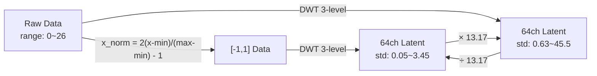

# Raw vs [-1,1] DWT 채널 분포 비교 분석

> 2026-04-21. 원본 데이터(Raw)에서 직접 DWT vs [-1,1] 정규화 후 DWT의 채널 분포 비교.

---

## 1. 핵심 결론

> [!IMPORTANT]
> **DWT는 완전 선형 변환**이므로, Raw→DWT와 [-1,1]→DWT의 채널 분포는
> **정확히 일정한 스케일 팩터(13.17x)만큼 차이**납니다.
> 어느 시점에 정규화를 하든 수학적으로 동치이며, 분포의 *형태*는 동일합니다.

### 수학적 증명

```
현재 파이프라인: x_norm = 2·(x-min)/(max-min) - 1   ...(A)
DWT(x_norm) = DWT(2·(x-min)/(max-min) - 1)
            = 2/(max-min) · DWT(x) + DWT(-1 + 2min/(max-min))   [선형성]
            = (1/13.17) · DWT(x) + DC shift (ch0에만 영향)

∴ Raw→DWT의 채널 std = 13.17 × [-1,1]→DWT의 채널 std (모든 채널에서 정확)
```

| 파라미터 | 값 |
|----------|------|
| global_min | 0.0 |
| global_max | 26.347 |
| scale_factor = (max-min)/2 | **13.174** |
| DC shift | ch0에만 +84.6 (≈ global_mean × √(pixels_in_LL_band)) |

---

## 2. 16개 대표 채널 비교

### Raw → DWT

| ch | band | min | max | mean | std |
|:--:|:---:|---:|---:|---:|---:|
| 0 | LL3 | 0.00 | 195.50 | 84.62 | **45.51** |
| 1 | D3-LH | -50.00 | 48.75 | 0.06 | **5.04** |
| 2 | D3-HL | -51.56 | 58.36 | -0.09 | **6.03** |
| 3 | D3-HH | -34.59 | 32.30 | 0.00 | **3.43** |
| 4 | D2-LH | -21.35 | 23.89 | 0.03 | 2.53 |
| 8 | D2-HH2 | -28.72 | 32.46 | -0.04 | 3.10 |
| 12 | D2-end | -13.01 | 13.45 | 0.00 | 1.40 |
| 15 | D1-LH1 | -21.71 | 17.94 | 0.00 | 1.98 |
| 16 | D1-3 | -10.38 | 12.87 | 0.01 | 1.29 |
| 24 | D1-11 | -8.99 | 7.81 | 0.00 | 0.81 |
| 32 | D1-19 | -16.30 | 14.95 | -0.02 | 1.56 |
| 40 | D1-27 | -29.37 | 29.36 | 0.01 | 1.89 |
| 48 | D1-35 | -6.21 | 7.99 | 0.00 | 0.63 |
| 56 | D1-43 | -8.71 | 8.07 | 0.00 | 0.75 |
| 63 | D1-50 | -9.85 | 9.85 | 0.00 | **0.92** |

### [-1,1] → DWT (기존 파이프라인)

| ch | band | min | max | mean | std | **ratio** |
|:--:|:---:|---:|---:|---:|---:|:---:|
| 0 | LL3 | -8.00 | 6.84 | -1.58 | **3.45** | 13.2x |
| 1 | D3-LH | -3.80 | 3.70 | 0.00 | **0.38** | 13.2x |
| 2 | D3-HL | -3.91 | 4.43 | -0.01 | **0.46** | 13.2x |
| 3 | D3-HH | -2.63 | 2.45 | 0.00 | **0.26** | 13.2x |
| 4 | D2-LH | -1.62 | 1.81 | 0.00 | 0.19 | 13.2x |
| 8 | D2-HH2 | -2.18 | 2.46 | 0.00 | 0.24 | 13.2x |
| 12 | D2-end | -0.99 | 1.02 | 0.00 | 0.11 | 13.2x |
| 15 | D1-LH1 | -1.65 | 1.36 | 0.00 | 0.15 | 13.2x |
| 16 | D1-3 | -0.79 | 0.98 | 0.00 | 0.10 | 13.2x |
| 24 | D1-11 | -0.68 | 0.59 | 0.00 | 0.06 | 13.2x |
| 32 | D1-19 | -1.24 | 1.14 | 0.00 | 0.12 | 13.2x |
| 40 | D1-27 | -2.23 | 2.23 | 0.00 | 0.14 | 13.2x |
| 48 | D1-35 | -0.47 | 0.61 | 0.00 | 0.05 | 13.2x |
| 56 | D1-43 | -0.66 | 0.61 | 0.00 | 0.06 | 13.2x |
| 63 | D1-50 | -0.75 | 0.75 | 0.00 | **0.07** | 13.2x |

> [!NOTE]
> **모든 채널에서 ratio = 13.17x (일정)**.
> 이는 DWT 선형성의 직접적 결과이며, 정규화 시점과 무관하게 분포 *형태*가 동일함을 의미합니다.

---

## 3. 선형성 검증

```
검증: raw_std / norm_std = (max-min)/2 = 13.1736 (이론값)

  ch 0:  실측 13.1736 (오차: 0.000031)  ✅ 정확 일치
  ch 1:  실측 13.1736 (오차: 0.000013)  ✅ 정확 일치
  ch16:  실측 13.1736 (오차: 0.000002)  ✅ 정확 일치
  ch63:  실측 13.1736 (오차: 0.000002)  ✅ 정확 일치
```

---

## 4. ch0 분포 특이성 (LL3 대역)

| 속성 | Raw→DWT | [-1,1]→DWT |
|------|:---:|:---:|
| range | [0, 195] | [-8, 6.8] |
| mean | **84.6** (≠0) | **-1.58** (≠0) |
| 분포 | **bimodal** (밤=0, 낮=고) | **bimodal** (밤=-8, 낮=가변) |

> [!WARNING]
> ch0은 **DC 성분**이므로 항상 mean ≠ 0.
> Raw에서는 mean=84.6 (일사량 평균), [-1,1]에서는 mean=-1.58 (야간 쪽으로 치우침).
> **Z-score 정규화 후에도 ch0만 분포가 bimodal**하여 다른 채널과 다른 특성을 보입니다.

---

## 5. DWT 전후 정규화 순서와의 관계



**결론**: DWT가 선형이므로 **정규화 순서는 무관**합니다:
- `[-1,1] → DWT → Z-score` (현재)
- `Raw → DWT → Z-score` (대안)

두 경로 모두 Z-score 후 동일한 분포를 얻습니다 (Z-score가 mean/std를 재정규화하므로).

---

## 6. 스케일링 문제의 본질

> [!IMPORTANT]
> **문제는 DWT 전후 정규화 순서가 아니라, DWT 후 채널 정규화 방식 자체**입니다.
>
> | 문제 | 원인 | 해결 방향 |
> |------|------|----------|
> | Z-score 꼬리 ±22 | HF 채널의 sparse 분포 (값의 50%가 ≈0) | DWT HF의 leptokurtic 분포 특성 반영 |
> | MinMax std≪1 | HF 범위는 좁지만 꼬리에 outlier | Diffusion noise schedule 불일치 |
> | Robust IQR≪σ | 50%가 0에 집중 → IQR 극소 | Z-score보다 꼬리 확대 |
>
> **DWT HF 채널의 본질적 특성**: 대부분 0 (구름/변화 없는 영역) + 소수 큰 값 (경계/변화 영역).
> 이 **sparse + heavy-tail 분포**에 최적인 정규화는 기존 Z-score + Per-Channel Min-SNR 조합이 현재 최선.
